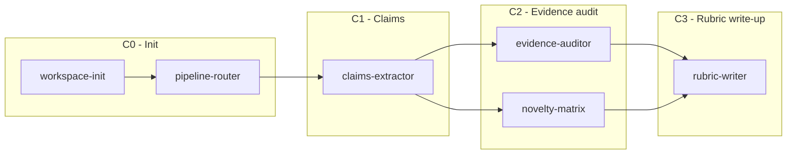

# PIPELINE_FLOWS

## Legend

- Required skill: solid node
- Optional skill: dashed node
- HUMAN checkpoint: red node

## arxiv-survey (C0–C5)

```mermaid
flowchart LR
  classDef optional stroke-dasharray: 5 5;
  classDef human fill:#ffebee,stroke:#e53935,color:#b71c1c,stroke-width:2px;

  subgraph "C0 - Init"
    WS[workspace-init]
    PR0[pipeline-router]
  end

  subgraph "C1 - Retrieval & core set"
    KX[keyword-expansion]:::optional
    LE[literature-engineer]
    DR[dedupe-rank]
    SSH[survey-seed-harvest]:::optional
  end

  subgraph "C2 - Structure [NO PROSE]"
    TB[taxonomy-builder]
    OB[outline-builder]
    OBU[outline-budgeter]:::optional
    SM[section-mapper]
    OR[outline-refiner]
    PR2[pipeline-router]
    C2A{{Approve C2 (HUMAN)}}:::human
  end

  subgraph "C3 - Evidence [NO PROSE]"
    PT[pdf-text-extractor]
    PN[paper-notes]
    SB[subsection-briefs]
    CB[chapter-briefs]
  end

  subgraph "C4 - Citations + evidence packs [NO PROSE]"
    CV[citation-verifier]
    EB[evidence-binder]
    ED[evidence-draft]
    AS[anchor-sheet]
    TS[table-schema]
    TF[table-filler]
    ATW[appendix-table-writer]
    SN[schema-normalizer]
    WCP[writer-context-pack]
    ESL[evidence-selfloop]
    CMR[claim-matrix-rewriter]
    SV[survey-visuals]:::optional
  end

  subgraph "C5 - Writing [PROSE after C2]"
    FMW[front-matter-writer]
    CLW[chapter-lead-writer]
    SW[subsection-writer]
    WSL[writer-selfloop]
    SH[style-harmonizer]
    SLP[section-logic-polisher]
    TW[transition-weaver]
    MG[section-merger]
    PMVG[post-merge-voice-gate]
    CD[citation-diversifier]
    CI[citation-injector]
    DP[draft-polisher]
    GR[global-reviewer]
    PA[pipeline-auditor]
    ACA[artifact-contract-auditor]
    LS[latex-scaffold]:::optional
    LCQ[latex-compile-qa]:::optional
  end

  WS --> PR0 --> LE --> DR --> TB --> OB --> SM --> OR --> PR2 --> C2A --> PT --> PN --> SB --> CB --> CV --> EB --> ED --> AS --> TS --> TF --> ATW --> SN --> WCP --> ESL --> CMR --> FMW --> CLW --> SW --> WSL --> SH --> SLP --> TW --> MG --> PMVG --> CD --> CI --> DP --> GR --> PA --> ACA
  KX -.-> LE
  SSH -.-> TB
  OB -.-> OBU -.-> SM
  CMR -.-> SV
  PA -.-> LS -.-> LCQ
```

## arxiv-survey-latex (C0–C5)

```mermaid
flowchart LR
  classDef optional stroke-dasharray: 5 5;
  classDef human fill:#ffebee,stroke:#e53935,color:#b71c1c,stroke-width:2px;

  subgraph "C0 - Init"
    WS[workspace-init]
    PR0[pipeline-router]
  end

  subgraph "C1 - Retrieval & core set"
    KX[keyword-expansion]:::optional
    LE[literature-engineer]
    DR[dedupe-rank]
    SSH[survey-seed-harvest]:::optional
  end

  subgraph "C2 - Structure [NO PROSE]"
    TB[taxonomy-builder]
    OB[outline-builder]
    OBU[outline-budgeter]:::optional
    SM[section-mapper]
    OR[outline-refiner]
    PR2[pipeline-router]
    C2A{{Approve C2 (HUMAN)}}:::human
  end

  subgraph "C3 - Evidence [NO PROSE]"
    PT[pdf-text-extractor]
    PN[paper-notes]
    SB[subsection-briefs]
    CB[chapter-briefs]
  end

  subgraph "C4 - Citations + evidence packs [NO PROSE]"
    CV[citation-verifier]
    EB[evidence-binder]
    ED[evidence-draft]
    AS[anchor-sheet]
    TS[table-schema]
    TF[table-filler]
    ATW[appendix-table-writer]
    SN[schema-normalizer]
    WCP[writer-context-pack]
    ESL[evidence-selfloop]
    CMR[claim-matrix-rewriter]
    SV[survey-visuals]:::optional
  end

  subgraph "C5 - Writing + PDF [PROSE after C2]"
    FMW[front-matter-writer]
    CLW[chapter-lead-writer]
    SW[subsection-writer]
    WSL[writer-selfloop]
    SH[style-harmonizer]
    SLP[section-logic-polisher]
    TW[transition-weaver]
    MG[section-merger]
    PMVG[post-merge-voice-gate]
    CD[citation-diversifier]
    CI[citation-injector]
    DP[draft-polisher]
    GR[global-reviewer]
    PA[pipeline-auditor]
    LS[latex-scaffold]
    LCQ[latex-compile-qa]
    ACA[artifact-contract-auditor]
  end

  WS --> PR0 --> LE --> DR --> TB --> OB --> SM --> OR --> PR2 --> C2A --> PT --> PN --> SB --> CB --> CV --> EB --> ED --> AS --> TS --> TF --> ATW --> SN --> WCP --> ESL --> CMR --> FMW --> CLW --> SW --> WSL --> SH --> SLP --> TW --> MG --> PMVG --> CD --> CI --> DP --> GR --> PA --> LS --> LCQ --> ACA
  KX -.-> LE
  SSH -.-> TB
  OB -.-> OBU -.-> SM
  CMR -.-> SV
```

## lit-snapshot (C0–C3)

```mermaid
flowchart LR
  classDef optional stroke-dasharray: 5 5;
  classDef human fill:#ffebee,stroke:#e53935,color:#b71c1c,stroke-width:2px;

  subgraph "C0 - Init"
    WS[workspace-init]
    PR0[pipeline-router]
  end

  subgraph "C1 - Retrieval & core set"
    KX[keyword-expansion]:::optional
    AS[arxiv-search]
    DR[dedupe-rank]
  end

  subgraph "C2 - Structure [NO PROSE]"
    TB[taxonomy-builder]
    OB[outline-builder]
    OBU[outline-budgeter]:::optional
    PR2[pipeline-router]
    C2A{{Approve C2 (HUMAN)}}:::human
  end

  subgraph "C3 - Snapshot [SHORT PROSE]"
    SW[snapshot-writer]
    PW[prose-writer]:::optional
  end

  WS --> PR0 --> AS --> DR --> TB --> OB --> PR2 --> C2A --> SW
  KX -.-> AS
  OB -.-> OBU -.-> PR2
  C2A -.-> PW
```

## tutorial (C0–C3)

```mermaid
flowchart LR
  classDef optional stroke-dasharray: 5 5;
  classDef human fill:#ffebee,stroke:#e53935,color:#b71c1c,stroke-width:2px;

  subgraph "C0 - Init"
    WS[workspace-init]
    PR0[pipeline-router]
  end

  subgraph "C1 - Spec"
    TS[tutorial-spec]
  end

  subgraph "C2 - Structure [NO PROSE]"
    CG[concept-graph]
    MP[module-planner]
    EB[exercise-builder]
    C2A{{Approve C2 (HUMAN)}}:::human
  end

  subgraph "C3 - Writing [PROSE]"
    TMW[tutorial-module-writer]
  end

  WS --> PR0 --> TS --> CG --> MP --> EB --> C2A --> TMW
```

## systematic-review (C0–C5)

```mermaid
flowchart LR
  classDef optional stroke-dasharray: 5 5;
  classDef human fill:#ffebee,stroke:#e53935,color:#b71c1c,stroke-width:2px;

  subgraph "C0 - Init"
    WS[workspace-init]
    PR0[pipeline-router]
  end

  subgraph "C1 - Protocol"
    PR[protocol-writer]
    C1A{{Approve C1 (HUMAN)}}:::human
  end

  subgraph "C2 - Retrieval & candidate pool"
    KX[keyword-expansion]:::optional
    AS[arxiv-search]:::optional
    LE[literature-engineer]
    DR[dedupe-rank]
  end

  subgraph "C3 - Screening"
    SCM[screening-manager]
  end

  subgraph "C4 - Extraction"
    EF[extraction-form]
    BA[bias-assessor]
  end

  subgraph "C5 - Synthesis [PROSE]"
    SW[synthesis-writer]
  end

  WS --> PR0 --> PR --> C1A --> LE --> DR --> SCM --> EF --> BA --> SW
  KX -.-> LE
  AS -.-> DR
```

## peer-review (C0–C3)


