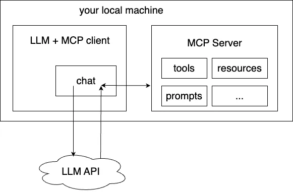
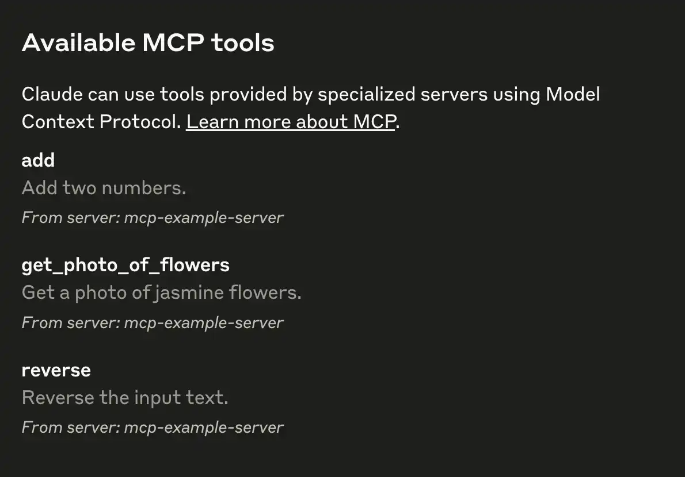
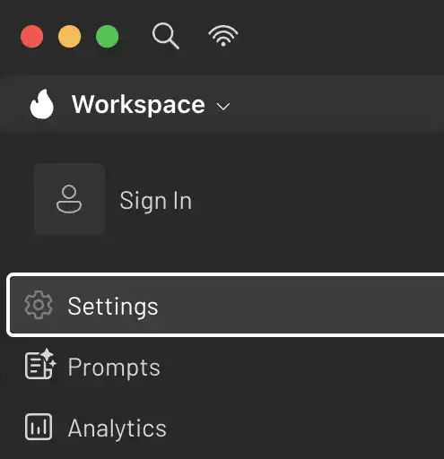
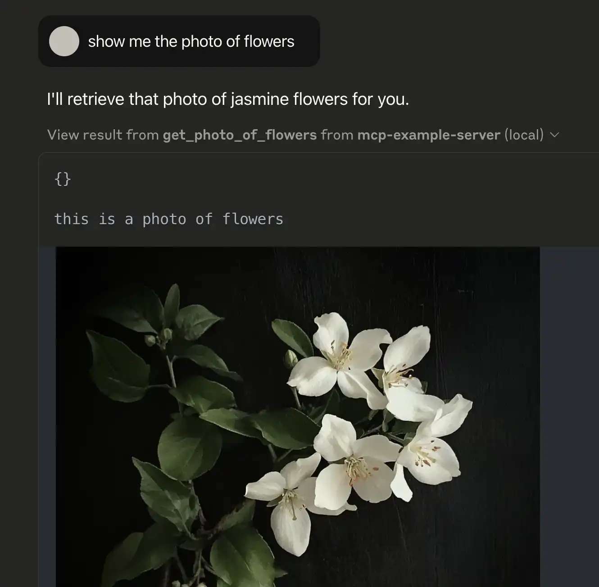

# Step-by-step guide to configure MCP servers for AI client apps locally

This guide provides step-by-step instructions to integrate an MCP server into an AI client application and help you understand how MCP works.

Let's use `example-server` defined in this repo as an example.

## Prerequisites

- [Python](https://www.python.org/downloads/) >= 3.12

## What you specifically need

Let's make a quick summary of what you actually need to use MCP server locally:

- A MCP server (e.g. `example-server` in this case) which contains multiple tools and resources inside.
- An AI client with MCP support, e.g.:
  - [Goose](https://block.github.io/goose/) (Open source, free)
  - [Claude Desktop](https://claude.ai/download) (Close source, by Claude, commercial)

their relationship is like:

<div align="center">

</div>

inside our example servers. there are 3 tools:

- `add`: add two numbers
- `get_photo_of_flowers`: get a photo of jasmine
- `reverse`: reverse a string

**Tools** are defined to enable servers to expose executable functionality to clients. Through tools, AI can interact with external systems, perform computations, and take actions in the real world.

For more details about architecture and core concepts, you can refer to [the official introduction](https://modelcontextprotocol.io/docs/concepts/architecture)

## Install `uv`

`uv` is a package manager for Python, we will use it to run the MCP server.

### macOS and Linux

Open Terminal , paste the following command, press 'Enter' to run:

```bash
curl -LsSf https://astral.sh/uv/install.sh | sh
```

<details>
<summary>👈 Cannot find the Terminal?</summary>

You can search for 'Terminal' in the Spotlight search (Cmd + Space) or Launchpad and open it.

</details>

### Windows

Open Powershell , paste the following command, press 'Enter' to run:

```powershell
powershell -ExecutionPolicy ByPass -c "irm https://astral.sh/uv/install.ps1 | iex"
```

<details>
<summary>👈 Cannot find the Powershell?</summary>

You can search for 'Powershell' in the Start menu (by pressing `Win` key and typing 'Powershell') or search bar and open it.

</details>

## Install and configure the client

We choose 3 commonly used clients here as an example. You can choose any one or the other on demand (the configuration method is similar)

### Claude Desktop (closed source, by Claude, free to use, no need for AI API key)

<details>
<summary>👈 Click to see detailed instructions</summary>

#### Installation

- Download and install [Claude Desktop](https://claude.ai/download)

#### Configure

- Open Claude Desktop
- Go to 'Settings'

<table style="width: 100%">
  <tr>
    <td></td>
    <td></td>
  </tr>
  <tr>
    <td align="center"><figcaption>macOS</figcaption></td>
    <td align="center"><figcaption>Windows</figcaption></td>
  </tr>
</table>

- Enter 'Developer' tab
<div align="center">
  
</div>

- Click 'Edit Config', you'll see the file manager window pop up, navigate to the directory of config file:
<table style="width: 100%">
  <tr>
    <td style="text-align: center; vertical-align: bottom">
      <br/>
    </td>
    <td style="text-align: center; vertical-align: bottom">
      <br/>
    </td>
  </tr>
  <tr>
    <td align="center"><figcaption>macOS</figcaption></td>
    <td align="center"><figcaption>Windows</figcaption></td>
  </tr>
</table>
For macOS, you can open the config file in TextEdit.


For Windows, you can open the config file in Notepad.


replace the content of config file with:

```json
{
  "mcpServers": {
    "example-server": {
      "command": "uvx",
      "args": [
        "mcp-science",
        "example-server"
      ]
    }
  }
}
```

and save save the changes.

Restart Claude Desktop. There should be a hammer icon on the bottom of the input box, click it then you can see the tool list.

<table>
  <tr>
    <td width="50%"></td>
    <td width="50%"></td>
  </tr>
</table>

And now, you've successfully integrated the example server into Claude Desktop.

</details>

### 5ire (open source, need AI API key, macOS / Linux / Windows)

<details>
<summary>👈 Click to see detailed instructions</summary>

[5ire](https://5ire.app/) is a cross-platform desktop AI assistant, MCP client.

#### Installation

- Download and install 5ire from [official website](https://5ire.app/)

#### Get an AI API key

If you don't have an AI API key, we recommend obtaining one from [OpenRouter](https://openrouter.ai/), which offers a unified interface for popular large language models. With no subscription required, you can simply pay as you go.

#### AI provider configuration

Let's use `gpt-4o-mini` in this example.

Open 5ire, go to 'Settings':

<div align="center">
  
</div>

Enter Your API key of OpenRouter in the 'API Key' field, update the 'API Base' as `https://api.openrouter.ai/api/v1` and configure the 'Model Mapping' as:

```json
{
  "gpt-4o-mini": "openai/gpt-4o-mini"
}
```

The settings should be updated like this:

<table style="width: 100%">
  <tr>
    <td style="text-align: center; vertical-align: bottom">
      
    </td>
    <td style="text-align: center; vertical-align: bottom">
      
    </td>
  </tr>
  <tr>
    <td><figcaption>AI settings</figcaption></td>
    <td><figcaption>Model mapping</figcaption></td>
  </tr>
</table>

#### MCP server configuration

Enter 'Tools' tab in the sidebar, then click 'New' button on the upper right:

<table>
  <tr>
    <td align="center"></td>
    <td align="center"></td>
  </tr>
  <tr>
    <td align="center">5ire Tools tab</td>
    <td align="center">5ire New Tool</td>
  </tr>
</table>

Enter `example` in 'Tool Key' field, enter the following command in 'Command' field:

```bash
uvx mcp-science example-server
```

The new tool configuration should be like this:

<table>
  <tr>
    <td align="center"></td>
  </tr>
  <tr>
    <td align="center">5ire Tool Configuration</td>
  </tr>
</table>

Click 'Save' button.

You should see a new tool called 'example' on the list. click the toggle button to enable it.

<table>
  <tr>
    <td align="center"></td>
  </tr>
  <tr>
    <td align="center">5ire New Tool Item</td>
  </tr>
</table>

</details>

### Goose Desktop (open source, need AI API key, macOS / Linux)

<details>
<summary>👈 Click to see detailed instructions</summary>

#### Installation

- Download and install Goose Desktop from [official website](https://block.github.io/goose/)

#### Configure AI API key from provider

This part is similar to 5ire, you can refer to the 5ire section.

#### MCP server configuration

Click the model button on the right bottom of the window, then click 'Tools and Settings' in the menu.

<table>
  <tr>
    <td align="center"></td>
  </tr>
  <tr>
    <td align="center">Goose Desktop Settings</td>
  </tr>
</table>

Find 'Extensions' section, click 'Add custom extension' button.

<table>
  <tr>
    <td align="center"></td>
  </tr>
  <tr>
    <td align="center">Goose Add Custom Extension</td>
  </tr>
</table>

The new extension configuration should be like this:

<table align="center">
  <tr>
    <td align="center"></td>
  </tr>
  <tr>
    <td align="center">Goose Tool Configuration</td>
  </tr>
</table>

Click 'Add' to save the configuration and click the toggle button to enable it

<table align="center">
  <tr>
    <td align="center"></td>
  </tr>
  <tr>
    <td align="center">Goose Extension Item</td>
  </tr>
</table>

</details>

<br>

So far, you should have successfully integrated the example server into your client. Let's try some simple examples:

## Try with example queries

### Number addition

- Ask AI: `Add 99 and 42`
- The AI will call the `add` tool
- On Claude Desktop, you'll see a popup asking for confirmation during the call, click 'Allow for this chat' to allow the tool call:
<table align="center">
  <tr>
    <td align="center"></td>
  </tr>
  <tr>
    <td align="center">Claude Desktop confirmation popup</td>
  </tr>
</table>

- The Claude output should be like (you need expand the result section manually):
<table align="center">
  <tr>
    <td align="center"></td>
  </tr>
  <tr>
    <td align="center">Claude Desktop</td>
  </tr>
</table>

### Get photo of flowers

- Ask AI: `show me the photo of flowers`
- The AI should call the `get_photo_of_flowers` tool
- You'll see the image inside the result section:
<table align="center">
  <tr>
    <td align="center"></td>
  </tr>
  <tr>
    <td align="center">Claude Desktop</td>
  </tr>
</table>

### Reverse text

- Ask AI: `reverse the text 'hello world'`
- The AI will call the `reverse` tool
- You should get:
<table align="center">
  <tr>
    <td align="center"></td>
  </tr>
  <tr>
    <td align="center">Claude Desktop</td>
  </tr>
</table>
