# Repository Documentation Generator

**Production-ready 6-phase pipeline with intelligent orchestration, research-first validation, and conflict-free file ownership.**


<what>
This command orchestrates specialized AI agents in 6 phases to analyze your code repository and generate comprehensive documentation:
</what>

<steps>
  <phase_1>
  **Discovery+Analysis** (Phase 1)
  Agent: Opus
  Parallel: 4 parallel agents
  What: Analyze language, architecture, flows, and APIs
  Input: Repository path
  Output: `analysis.json`
  </phase_1>

  <phase_2>
  **Engineer Questions** (Phase 2)
  Agent: Opus
  What: Generates comprehensive questions based on the analysis
  Input: `analysis.json`
  Output: `questions.json`
  </phase_2>

  <phase_3>
  **Research Agent** (Phase 3) 🆕
  Agent: Sonnet
  Parallel: Dynamic (based on question volume)
  What: Deep-dive code forensics to ANSWER the questions with evidence
  Input: `questions.json`
  Output: `research.json`
  </phase_3>

  <phase_4>
  **Orchestrator** (Phase 4)
  Agent: Opus
  What: Groups questions by file target and assigns exclusive file ownership to writers
  Input: `questions.json` + `research.json`
  Output: `work-assignments.json` (file-based assignments for parallel writers)
  </phase_4>

  <phase_5>
  **Documentation Writers** (Phase 5)
  Agent: Sonnet
  Parallel: 1-8 parallel agents (dynamic based on workload)
  What: Synthesize research and write comprehensive documentation with exclusive file ownership
  Input: `analysis.json` + `questions.json` + `research.json` + `work-assignments.json`
  Output: `documentation/*.md` (16 core docs, 5 required + supplementary files)
  </phase_5>

  <phase_6>
  **QA Validator** (Phase 6)
  Agent: Sonnet
  What: Validates documentation quality using LSP-powered verification
  Input: `documentation/*.md` + `analysis.json` + `questions.json`
  Output: `qa-results.json` + `QA-SUMMARY.md`
  </phase_6>
</steps>

<subagents>
Use spawn explore opus/sonnet/haiku subagents to explore code with MCP tools (localSearchCode, lspGotoDefinition, lspCallHierarchy, lspFindReferences)
</subagents>

**Documentation Flow:** analysis.json → questions.json → **research.json** → work-assignments.json → documentation (conflict-free!)

---

## ⚠️ CRITICAL: Parallel Agent Execution

<parallel_execution_critical importance="maximum">

**STOP. READ THIS TWICE.**

### 1. THE RULE
**You MUST spawn parallel agents in a SINGLE message with multiple Task tool calls.**

### 2. FORBIDDEN BEHAVIOR
**FORBIDDEN:** Calling `Task` sequentially (one per response).
**REASON:** Sequential calls defeat parallelism and slow down execution by 4x-8x.

### 3. REQUIRED CONFIRMATION
Before launching any parallel phase (1, 3, 5), you **MUST** verify:
- [ ] All Task calls are prepared for a SINGLE response
- [ ] No dependencies exist between these parallel agents
- [ ] Each agent has exclusive scope (no file conflicts)

<correct_pattern title="✅ CORRECT: Single response launches all agents concurrently">
```
// In ONE assistant message, include ALL Task tool invocations:
Task(description="Discovery 1A-language", subagent_type="general-purpose", prompt="...", model="opus")
Task(description="Discovery 1B-components", subagent_type="general-purpose", prompt="...", model="opus")
Task(description="Discovery 1C-dependencies", subagent_type="general-purpose", prompt="...", model="opus")
Task(description="Discovery 1D-flows", subagent_type="general-purpose", prompt="...", model="opus")
// ↑ All 4 execute SIMULTANEOUSLY
```
</correct_pattern>

<wrong_pattern title="❌ WRONG: Sequential calls lose parallelism">
```
// DON'T DO THIS - Each waits for previous to complete
Message 1: Task(description="Discovery 1A") → wait for result
Message 2: Task(description="Discovery 1B") → wait for result
Message 3: Task(description="Discovery 1C") → wait for result
Message 4: Task(description="Discovery 1D") → wait for result
// ↑ 4x slower! No parallelism achieved
```
</wrong_pattern>

</parallel_execution_critical>

---

## Execution Flow Diagram

```mermaid
flowchart TB
    Start([/octocode-documentaion-writer PATH]) --> Validate[Pre-Flight Validation]
    Validate --> Init[Initialize Workspace]

    Init --> P1[Phase 1: Discovery+Analysis]

    subgraph P1_Parallel["🔄 RUN IN PARALLEL (4 agents)"]
        P1A[Agent 1A:<br/>Language & Manifests]
        P1B[Agent 1B:<br/>Components]
        P1C[Agent 1C:<br/>Dependencies]
        P1D[Agent 1D:<br/>Flows & APIs]
    end

    P1 --> P1_Parallel
    P1_Parallel --> P1Agg[Aggregation:<br/>Merge into analysis.json]
    P1Agg --> P1Done[✅ analysis.json created]

    P1Done -->|Reads analysis.json| P2[Phase 2: Engineer Questions<br/>Single Agent - Opus]
    P2 --> P2Done[✅ questions.json created]

    P2Done -->|Reads questions.json| P3[Phase 3: Research 🆕<br/>Parallel Agents - Sonnet]
    
    subgraph P3_Parallel["🔄 RUN IN PARALLEL"]
       P3A[Researcher 1]
       P3B[Researcher 2]
       P3C[Researcher 3]
    end
    
    P3 --> P3_Parallel
    P3_Parallel --> P3Agg[Aggregation:<br/>Merge into research.json]
    P3Agg --> P3Done[✅ research.json created<br/>Evidence-backed answers]

    P3Done -->|Reads questions + research| P4[Phase 4: Orchestrator<br/>Single Agent - Opus]
    P4 --> P4Group[Group questions<br/>by file target]
    P4 --> P4Assign[Assign file ownership<br/>to writers]
    P4Assign --> P4Done[✅ work-assignments.json]

    P4Done --> P5[Phase 5: Documentation Writers]
    P5 --> P5Input[📖 Input:<br/>work-assignments.json<br/>+ research.json]
    P5Input --> P5Dist[Each writer gets<br/>exclusive file ownership]

    subgraph P5_Parallel["🔄 RUN IN PARALLEL (1-8 agents)"]
        P5W1[Writer 1]
        P5W2[Writer 2]
        P5W3[Writer 3]
        P5W4[Writer 4]
    end

    P5Dist --> P5_Parallel
    P5_Parallel --> P5Verify[Verify Structure]
    P5Verify --> P5Done[✅ documentation/*.md created]

    P5Done --> P6[Phase 6: QA Validator<br/>Single Agent - Sonnet]
    P6 --> P6Done[✅ qa-results.json +<br/>QA-SUMMARY.md]

    P6Done --> Complete([✅ Documentation Complete])

    style P1_Parallel fill:#e1f5ff
    style P3_Parallel fill:#e1f5ff
    style P5_Parallel fill:#ffe1f5
    style P4 fill:#fff3cd
    style Complete fill:#28a745,color:#fff
```



### Parallel Execution Rules

<execution_rules>
    <phase name="1-discovery" type="parallel" critical="true" spawn="single_message">
        <gate>
        **STOP.** Verify parallel spawn requirements.
        **REQUIRED:** Spawn 4 agents in ONE message.
        **FORBIDDEN:** Sequential Task calls.
        </gate>
        <agent_count>4</agent_count>
        <description>Discovery and Analysis</description>
        <spawn_instruction>⚠️ Launch ALL 4 Task calls in ONE response</spawn_instruction>
        <rules>
            <rule>All 4 agents start simultaneously via single-message spawn</rule>
            <rule>Wait for ALL 4 to complete before aggregation</rule>
            <rule>Must aggregate 4 partial JSONs into analysis.json</rule>
        </rules>
    </phase>

    <phase name="2-questions" type="single" critical="true" spawn="sequential">
        <agent_count>1</agent_count>
        <description>Engineer Questions Generation</description>
        <spawn_instruction>Single agent, wait for completion</spawn_instruction>
    </phase>

    <phase name="3-research" type="parallel" critical="true" spawn="single_message">
        <gate>
        **STOP.** Verify parallel spawn requirements.
        **REQUIRED:** Spawn N researchers in ONE message.
        **FORBIDDEN:** Sequential Task calls.
        </gate>
        <agent_count_logic>
            <case condition="questions &lt; 10">1 agent</case>
            <case condition="questions &gt;= 10">Ceil(questions / 15)</case>
        </agent_count_logic>
        <description>Evidence Gathering</description>
        <spawn_instruction>⚠️ Launch ALL researcher Task calls in ONE response</spawn_instruction>
        <rules>
            <rule>Split questions into batches BEFORE spawning</rule>
            <rule>All researchers start simultaneously</rule>
            <rule>Aggregate findings into research.json</rule>
        </rules>
    </phase>

    <phase name="4-orchestrator" type="single" critical="true" spawn="sequential">
        <agent_count>1</agent_count>
        <description>Orchestration and Assignment</description>
        <spawn_instruction>Single agent, wait for completion</spawn_instruction>
        <rules>
            <rule>Assign EXCLUSIVE file ownership to writers</rule>
            <rule>Distribute research findings to relevant writers</rule>
        </rules>
    </phase>

    <phase name="5-writers" type="dynamic_parallel" critical="false" spawn="single_message">
        <gate>
        **STOP.** Verify parallel spawn requirements.
        **REQUIRED:** Spawn all writers in ONE message.
        **FORBIDDEN:** Sequential Task calls.
        </gate>
        <agent_count_logic>
            <case condition="questions &lt; 20">1 agent</case>
            <case condition="questions 20-99">2-4 agents</case>
            <case condition="questions &gt;= 100">4-8 agents</case>
        </agent_count_logic>
        <spawn_instruction>⚠️ Launch ALL writer Task calls in ONE response</spawn_instruction>
        <rules>
            <rule>Each writer owns EXCLUSIVE files - no conflicts possible</rule>
            <rule>All writers start simultaneously via single-message spawn</rule>
            <rule>Use provided research.json as primary source</rule>
        </rules>
    </phase>

    <phase name="6-qa" type="single" critical="false" spawn="sequential">
        <agent_count>1</agent_count>
        <description>Quality Validation</description>
        <spawn_instruction>Single agent, wait for completion</spawn_instruction>
    </phase>
</execution_rules>

## Pre-Flight Checks

<pre_flight_gate>
**HALT. Complete these requirements before proceeding:**

### Required Checks
1. **Verify Path Existence**
   - **IF** `repository_path` missing → **THEN** ERROR & EXIT
2. **Verify Directory Status**
   - **IF** not a directory → **THEN** ERROR & EXIT
3. **Source Code Check**
   - **IF** < 3 source files → **THEN** WARN & Ask User (Exit if no)
4. **Build Directory Check**
   - **IF** contains `node_modules` or `dist` → **THEN** ERROR & EXIT
5. **Size Estimation**
   - **IF** > 200k LOC → **THEN** WARN & Ask User (Exit if no)

**FORBIDDEN until gate passes:**
- Any agent spawning
- Workspace initialization
</pre_flight_gate>

<instruction>
Before starting, validate the repository path and check for edge cases.

1. **Verify Path Existence**
   - Ensure `repository_path` exists.
   - If not, raise an ERROR: "Repository path does not exist: " + path and EXIT.

2. **Verify Directory Status**
   - Confirm `repository_path` is a directory.
   - If not, raise an ERROR: "Path is not a directory: " + path and EXIT.

3. **Source Code Check**
   - Count files ending in `.ts`, `.js`, `.py`, `.go`, or `.rs`.
   - Exclude directories: `node_modules`, `.git`, `dist`, `build`.
   - If fewer than 3 source files are found:
     - WARN: "Very few source files detected ({count}). This may not be a code repository."
     - Ask user: "Continue anyway? [y/N]"
     - If not confirmed, EXIT.

4. **Build Directory Check**
   - Ensure the path does not contain `node_modules`, `dist`, or `build`.
   - If it does, raise an ERROR: "Repository path appears to be a build directory. Please specify the project root." and EXIT.

5. **Size Estimation**
   - Estimate the repository size.
   - If larger than 200,000 LOC:
     - WARN: "Large repository detected (~{size} LOC)."
     - Ask user: "Continue anyway? [y/N]"
     - If not confirmed, EXIT.
</instruction>

## Initialize Workspace

<init_gate>
**STOP. Verify state before initialization.**

### Required Actions
1. **Define Directories** (`CONTEXT_DIR`, `DOC_DIR`)
2. **Handle Existing State**
   - **IF** `state.json` exists → **THEN** Prompt User to Resume
   - **IF** User says NO → **THEN** Reset state
3. **Create Directories**
4. **Initialize New State** (if not resuming)

**FORBIDDEN:**
- Starting Phase 1 before state is initialized.
</init_gate>

<instruction>
### Workspace Initialization
Before starting the pipeline, set up the working environment and handle any existing state.

1. **Define Directories**
   - Context Directory (`CONTEXT_DIR`): `${REPOSITORY_PATH}/.context`
   - Documentation Directory (`DOC_DIR`): `${REPOSITORY_PATH}/documentation`

2. **Handle Existing State**
   - Check if `${CONTEXT_DIR}/state.json` exists.
   - If it exists and the phase is NOT "complete" or "failed":
     - **Prompt User**: "Found existing documentation generation in progress (phase: [PHASE]). Resume from last checkpoint? [Y/n]"
     - **If User Confirms (Yes)**:
       - Set `RESUME_MODE = true`
       - Set `START_PHASE` from the saved state.
     - **If User Declines (No)**:
       - **WARN**: "Restarting from beginning. Previous progress will be overwritten."
       - Set `RESUME_MODE = false`
       - Set `START_PHASE = "initialized"`
   - If `state.json` does not exist or previous run finished/failed, start fresh (`RESUME_MODE = false`).

3. **Create Directories**
   - Ensure `CONTEXT_DIR` exists (create if missing).
   - Ensure `DOC_DIR` exists (create if missing).

4. **Initialize New State** (If NOT Resuming)
   - Create a new `state.json` using the schema defined in `schemas/state-schema.json`.
</instruction>

## Progress Tracker

Display real-time progress:

```
📊 Documentation Generation Progress v3.1
━━━━━━━━━━━━━━━━━━━━━━━━━━━━━━━━━━━━━━━━━━

Repository: {REPOSITORY_PATH}
Mode: {RESUME_MODE ? "Resume" : "New"}

{if RESUME_MODE}
Resuming from: {START_PHASE}
{end}

━━━━━━━━━━━━━━━━━━━━━━━━━━━━━━━━━━━━━━━━━━
```

## Agent Pipeline Execution

### Phase 1: Discovery+Analysis Agent

<phase_1_gate>
**GATE: START Phase 1**
**REQUIRED:** Spawn 4 agents in **ONE** message.
**FORBIDDEN:** Sequential calls.
</phase_1_gate>

**Agent Spec**: `references/agent-discovery-analysis.md`
**Task Config**: `schemas/discovery-tasks.json`

| Property | Value |
|----------|-------|
| Parallel Agents | 4 (1a-language, 1b-components, 1c-dependencies, 1d-flows-apis) |
| Critical | Yes |
| Output | `.context/analysis.json` |

> See `references/agent-discovery-analysis.md` → **Orchestrator Execution Logic** section for full implementation.

### Phase 2: Engineer Questions Agent

**Agent Spec**: `references/agent-engineer-questions.md`

| Property | Value |
|----------|-------|
| Agent Type | Single (Opus) |
| Critical | Yes |
| Input | `.context/analysis.json` |
| Output | `.context/questions.json` |

> See `references/agent-engineer-questions.md` → **Orchestrator Execution Logic** section for full implementation.


### Phase 3: Research Agent 🆕

<phase_3_gate>
**GATE: START Phase 3**
**REQUIRED:** Spawn N agents in **ONE** message.
**FORBIDDEN:** Sequential calls.
</phase_3_gate>

**Agent Spec**: `references/agent-researcher.md`

| Property | Value |
|----------|-------|
| Agent Type | Parallel (Sonnet) |
| Critical | Yes |
| Input | `.context/questions.json` |
| Output | `.context/research.json` |

> See `references/agent-researcher.md` → **Orchestrator Execution Logic** section for full implementation.


### Phase 4: Orchestrator Agent

**Agent Spec**: `references/agent-orchestrator.md`

| Property | Value |
|----------|-------|
| Agent Type | Single (Opus) |
| Critical | Yes |
| Input | `.context/analysis.json`, `.context/questions.json`, `.context/research.json` |
| Output | `.context/work-assignments.json` |

> See `references/agent-orchestrator.md` → **Orchestrator Execution Logic** section for full implementation.

### Phase 5: Documentation Writers

<phase_5_gate>
**GATE: START Phase 5**
**REQUIRED:** Spawn all writers in **ONE** message.
**FORBIDDEN:** Sequential calls.
</phase_5_gate>

**Agent Spec**: `references/agent-documentation-writer.md`

| Property | Value |
|----------|-------|
| Agent Type | Parallel (1-8 Sonnet writers) |
| Primary Writer | Writer 1 (Critical) |
| Non-Primary | Partial failure allowed |
| Retry Logic | Up to 2 retries per failed writer |
| Input | `.context/analysis.json`, `.context/research.json`, `.context/work-assignments.json` |
| Output | `documentation/*.md` (16 core, 5 required + supplementary) |
| File Ownership | Exclusive (no conflicts) |

#### Writer Scaling Strategy

| Strategy | Agent Count | When Used |
|----------|-------------|-----------|
| `sequential` | 1 | < 20 questions |
| `parallel-core` | 2-4 | 20-99 questions |
| `parallel-all` | 4-8 | >= 100 questions |

> See `references/agent-documentation-writer.md` → **Orchestrator Execution Logic** section for full implementation.

### Phase 6: QA Validator

**Agent Spec**: `references/agent-qa-validator.md`

| Property | Value |
|----------|-------|
| Agent Type | Single (Sonnet) |
| Critical | No (failure produces warning) |
| Input | `.context/analysis.json`, `.context/questions.json`, `documentation/*.md` |
| Output | `.context/qa-results.json`, `documentation/QA-SUMMARY.md` |
| Score Range | 0-100 |
| Quality Ratings | `excellent` (≥90), `good` (≥75), `fair` (≥60), `needs-improvement` (<60) |

> See `references/agent-qa-validator.md` → **Orchestrator Execution Logic** section for full implementation.

## Completion

```javascript
update_state({
  phase: "complete",
  completed_at: new Date().toISOString(),
  current_agent: null
})

DISPLAY: "━━━━━━━━━━━━━━━━━━━━━━━━━━━━━━━━━━━━━━━━━━"
DISPLAY: "✅ Documentation Complete!"
DISPLAY: ""
DISPLAY: "📁 Location: {DOC_DIR}/"
DISPLAY: "📊 QA Report: {DOC_DIR}/QA-SUMMARY.md"
DISPLAY: ""

if (parsed_qa && parsed_qa.overall_score):
  DISPLAY: "Quality Score: {parsed_qa.overall_score}/100 ({parsed_qa.quality_rating})"

  if (parsed_qa.overall_score >= 90):
    DISPLAY: "Status: Excellent ✅ - Ready for release"
  else if (parsed_qa.overall_score >= 75):
    DISPLAY: "Status: Good ✅ - Minor improvements recommended"
  else if (parsed_qa.overall_score >= 60):
    DISPLAY: "Status: Fair -️ - Address gaps before release"
  else:
    DISPLAY: "Status: Needs Work -️ - Major improvements required"

  if (parsed_qa.gaps && parsed_qa.gaps.length > 0):
    DISPLAY: ""
    DISPLAY: "Next Steps:"
    for (i = 0; i < Math.min(3, parsed_qa.gaps.length); i++):
      gap = parsed_qa.gaps[i]
      DISPLAY: "  {i+1}. {gap.fix}"

DISPLAY: ""
DISPLAY: "📝 Documentation Coverage:"
DISPLAY: "   {parsed_questions.summary.total_questions} questions researched"
DISPLAY: "   {parsed_qa.question_coverage.answered} questions answered in docs"
DISPLAY: ""
DISPLAY: "View documentation: {DOC_DIR}/index.md"
DISPLAY: "━━━━━━━━━━━━━━━━━━━━━━━━━━━━━━━━━━━━━━━━━━"

EXIT code 0
```

## Error Recovery

If any agent fails critically:

```javascript
function handle_critical_failure(phase, error):
  DISPLAY: "━━━━━━━━━━━━━━━━━━━━━━━━━━━━━━━━━━━━━━━━━━"
  DISPLAY: "❌ Documentation Generation Failed"
  DISPLAY: ""
  DISPLAY: "Phase: {phase}"
  DISPLAY: "Error: {error.message}"
  DISPLAY: ""

  if (error.recoverable):
    DISPLAY: "This error is recoverable. Run /octocode-documentaion-writer again to resume."
    DISPLAY: "State saved in: {CONTEXT_DIR}/state.json"
  else:
    DISPLAY: "This error is not recoverable. Please check the error and try again."
    DISPLAY: "You may need to fix the issue before retrying."

  DISPLAY: ""
  DISPLAY: "Logs: {CONTEXT_DIR}/state.json"
  DISPLAY: "━━━━━━━━━━━━━━━━━━━━━━━━━━━━━━━━━━━━━━━━━━"

  EXIT code 1
```

## Helper Functions

> **IMPORTANT: State Synchronization**
> Only the main orchestrator process should update `state.json`. Individual parallel agents
> (Discovery 1A-1D, Researchers, Writers) must NOT directly modify `state.json` to avoid
> race conditions. Parallel agents should only write to their designated partial result files
> in `partials/<phase>/<task_id>.json`. The orchestrator aggregates these results and updates
> `state.json` after all parallel agents complete.

```javascript
// NOTE: This function should ONLY be called by the main orchestrator process,
// never by parallel sub-agents. Parallel agents use save_partial_result() instead.
function update_state(updates):
  current_state = Read(CONTEXT_DIR + "/state.json")
  parsed = JSON.parse(current_state)

  for key, value in updates:
    parsed[key] = value

  Write(CONTEXT_DIR + "/state.json", JSON.stringify(parsed, null, 2))

function estimate_repo_size(path):
  // Quick estimate: count source files
  files = count_files(path, ["*.ts", "*.js", "*.py", "*.go", "*.rs", "*.java"], excludeDir=["node_modules", ".git", "dist", "build"])
  // Assume ~200 LOC per file average
  return files * 200

function count_files(path, patterns, excludeDir):
  // Use localFindFiles MCP tool (mcp__octocode__localFindFiles)
  // Return count of matching files
```

## Retry & Data Preservation Logic

**CRITICAL**: Never lose partial work. All agents support retry with state preservation.

```javascript
const RETRY_CONFIG = {
  discovery_analysis: { max_attempts: 3, backoff_ms: 2000 },
  engineer_questions: { max_attempts: 3, backoff_ms: 2000 },
  research:           { max_attempts: 3, backoff_ms: 3000 },
  orchestrator:       { max_attempts: 3, backoff_ms: 2000 },
  documentation:      { max_attempts: 3, backoff_ms: 5000 },  // per writer
  qa:                 { max_attempts: 2, backoff_ms: 1000 }
}

// === RETRY WRAPPER FOR ALL AGENTS ===
function retry_agent(phase_name, agent_fn, options = {}):
  config = RETRY_CONFIG[phase_name]
  state = get_retry_state(phase_name)

  while (state.attempts < config.max_attempts):
    state.attempts++
    update_retry_state(phase_name, state)

    DISPLAY: `⟳ ${phase_name} attempt ${state.attempts}/${config.max_attempts}`

    try:
      result = agent_fn(options)

      // Success - clear retry state
      clear_retry_state(phase_name)
      return { success: true, result }

    catch (error):
      state.last_error = error.message
      update_retry_state(phase_name, state)

      DISPLAY: `⚠️ ${phase_name} failed: ${error.message}`

      if (state.attempts < config.max_attempts):
        DISPLAY: `   Retrying in ${config.backoff_ms}ms...`
        sleep(config.backoff_ms * state.attempts)  // Exponential backoff
      else:
        DISPLAY: `❌ ${phase_name} exhausted all ${config.max_attempts} attempts`
        return { success: false, error, attempts: state.attempts }

  return { success: false, error: state.last_error, attempts: state.attempts }

// === PARALLEL AGENT RETRY (for Discovery, Research, Writers) ===
function retry_parallel_agents(phase_name, agent_tasks, options = {}):
  config = RETRY_CONFIG[phase_name]
  results = {}
  failed_tasks = []

  // First attempt - run all in parallel
  parallel_results = Task_Parallel(agent_tasks)

  for (task_id, result) in parallel_results:
    if (result.success):
      results[task_id] = result
      save_partial_result(phase_name, task_id, result)
    else:
      failed_tasks.push({ id: task_id, task: agent_tasks[task_id], attempts: 1 })

  // Retry failed tasks individually
  for failed in failed_tasks:
    while (failed.attempts < config.max_attempts):
      failed.attempts++
      DISPLAY: `⟳ Retrying ${phase_name}/${failed.id} (attempt ${failed.attempts}/${config.max_attempts})`

      try:
        result = Task(failed.task)
        if (result.success):
          results[failed.id] = result
          save_partial_result(phase_name, failed.id, result)
          break
      catch (error):
        DISPLAY: `⚠️ ${phase_name}/${failed.id} failed: ${error.message}`
        if (failed.attempts < config.max_attempts):
          sleep(config.backoff_ms * failed.attempts)

    if (failed.attempts >= config.max_attempts && !results[failed.id]):
      DISPLAY: `❌ ${phase_name}/${failed.id} failed after ${config.max_attempts} attempts`
      // Load any partial result saved during attempts
      results[failed.id] = load_partial_result(phase_name, failed.id) || { success: false, partial: true }

  return results

// === PARTIAL RESULT PRESERVATION ===
// Uses atomic writes to prevent corruption from concurrent access
function save_partial_result(phase_name, task_id, result):
  partial_dir = CONTEXT_DIR + "/partials/" + phase_name
  mkdir_p(partial_dir)

  target_path = partial_dir + "/" + task_id + ".json"
  temp_path = partial_dir + "/" + task_id + ".json.tmp." + random_uuid()

  // Atomic write: write to temp file, then rename (rename is atomic on POSIX)
  Write(temp_path, JSON.stringify(result))
  rename(temp_path, target_path)  // Atomic operation

function load_partial_result(phase_name, task_id):
  path = CONTEXT_DIR + "/partials/" + phase_name + "/" + task_id + ".json"
  if (exists(path)):
    return JSON.parse(Read(path))
  return null

function load_all_partial_results(phase_name):
  partial_dir = CONTEXT_DIR + "/partials/" + phase_name
  if (!exists(partial_dir)):
    return {}
  files = list_files(partial_dir, "*.json")
  results = {}
  for file in files:
    task_id = file.replace(".json", "")
    results[task_id] = JSON.parse(Read(partial_dir + "/" + file))
  return results

// === RETRY STATE MANAGEMENT ===
function get_retry_state(phase_name):
  state = Read(CONTEXT_DIR + "/state.json")
  parsed = JSON.parse(state)
  return parsed.retry_state?.[phase_name] || { attempts: 0 }

function update_retry_state(phase_name, retry_state):
  update_state({
    retry_state: {
      ...current_state.retry_state,
      [phase_name]: retry_state
    }
  })

function clear_retry_state(phase_name):
  state = JSON.parse(Read(CONTEXT_DIR + "/state.json"))
  if (state.retry_state):
    delete state.retry_state[phase_name]
    Write(CONTEXT_DIR + "/state.json", JSON.stringify(state, null, 2))
```

### Phase-Specific Retry Behavior

| Phase | Retry Strategy | Partial Data Preserved |
|-------|----------------|------------------------|
| **Discovery** | Retry failed sub-agents (1A-1D) individually | `partials/discovery/*.json` |
| **Questions** | Retry entire phase | Previous `questions.json` kept until success |
| **Research** | Retry failed batches only | `partials/research/batch-*.json` |
| **Orchestrator** | Retry entire phase | Previous `work-assignments.json` kept |
| **Writers** | Retry failed writers only | `partials/writers/writer-*.json` + completed files |
| **QA** | Retry once, then warn | `partials/qa/partial-results.json` |

### Critical Data Protection Rules

```javascript
// RULE 1: Never overwrite successful output until new output is validated
function safe_write_output(path, content):
  backup_path = path + ".backup"
  if (exists(path)):
    copy(path, backup_path)

  try:
    Write(path, content)
    validate_json(path)  // Ensure valid JSON
    delete(backup_path)  // Only delete backup after validation
  catch (error):
    // Restore from backup
    if (exists(backup_path)):
      copy(backup_path, path)
    throw error

// RULE 2: Aggregate partial results even on failure
// Uses file locking to prevent race conditions during aggregation
function aggregate_with_partials(phase_name, new_results):
  lock_file = CONTEXT_DIR + "/partials/" + phase_name + "/.aggregate.lock"

  // Acquire exclusive lock before aggregation
  lock_fd = acquire_file_lock(lock_file, timeout_ms=5000)
  if (!lock_fd):
    throw new Error("Failed to acquire lock for aggregation: " + phase_name)

  try:
    existing = load_all_partial_results(phase_name)
    merged = { ...existing, ...new_results }
    return merged
  finally:
    release_file_lock(lock_fd)
    delete(lock_file)

// RULE 3: Resume-aware execution
function should_skip_task(phase_name, task_id):
  partial = load_partial_result(phase_name, task_id)
  return partial?.success === true
```
---

## Key Features

<key_features>

| # | Feature | Description |
|---|---------|-------------|
| 1 | **True Parallel Execution** | Phases 1, 3, 5 spawn ALL agents in ONE message for concurrent execution |
| 2 | **Single-Message Spawn** | ⚠️ Critical: Multiple Task calls in one response = true parallelism |
| 3 | **Evidence-Based** | Research agent proves answers with code traces before writing |
| 4 | **Engineer-Driven Questions** | Phase 2 generates comprehensive questions |
| 5 | **Conflict-Free Writing** | Orchestrator assigns exclusive file ownership per writer |
| 6 | **LSP-Powered** | Intelligent verification with semantic analysis |
| 7 | **State Recovery** | Resume from any phase if interrupted |
| 8 | **Unified Toolset** | All agents use octocode local + LSP tools |
| 9 | **Dynamic Scaling** | Agent count scales based on question volume |

</key_features>

<efficiency_summary>
### Efficiency Maximization

```
Phase 1: 4 agents × parallel = ~4x faster than sequential
Phase 3: N agents × parallel = ~Nx faster than sequential
Phase 5: M agents × parallel = ~Mx faster than sequential

Total speedup: Significant when spawn="single_message" is followed
```

**Remember**: `spawn="single_message"` phases MUST have all Task calls in ONE response.
</efficiency_summary>

---
