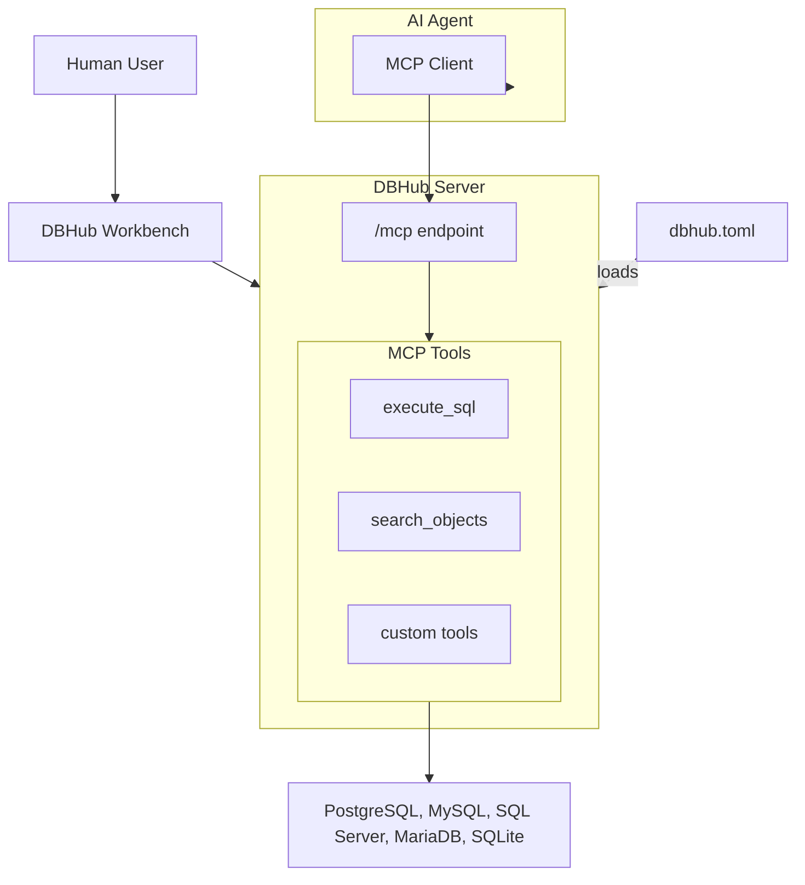

DBHub is a zero-dependency, token efficient MCP server implementing the Model Context Protocol server interface. This lightweight gateway allows MCP-compatible clients to connect to and explore different databases.

```
 +------------------+    +--------------+    +------------------+
 |                  |    |              |    |                  |
 |                  |    |              |    |                  |
 |  Claude Desktop  +--->+              +--->+    PostgreSQL    |
 |                  |    |              |    |                  |
 |  Claude Code     +--->+              +--->+    SQL Server    |
 |                  |    |              |    |                  |
 |  Cursor          +--->+    DBHub     +--->+    SQLite        |
 |                  |    |              |    |                  |
 |  VS Code         +--->+              +--->+    MySQL         |
 |                  |    |              |    |                  |
 |  Other Clients   +--->+              +--->+    MariaDB       |
 |                  |    |              |    |                  |
 |                  |    |              |    |                  |
 +------------------+    +--------------+    +------------------+
     MCP Clients           MCP Server             Databases
```

## Supported Databases

PostgreSQL, MySQL, SQL Server, MariaDB, and SQLite.

## Why DBHub?

DBHub brings powerful database capabilities to AI coding assistants:

- **Local Development First**: Zero dependency, token efficient with just two MCP tools to maximize context window
- **Multi-Database**: PostgreSQL, MySQL, MariaDB, SQL Server, and SQLite through a single interface
- **Multi-Connection**: Connect to multiple databases simultaneously with TOML configuration
- **Guardrails**: Read-only mode, row limiting, and query timeout to prevent runaway operations
- **Secure Access**: SSH tunneling and SSL/TLS encryption

## Key Features

### MCP Tools

DBHub provides AI assistants with direct database access through three core tools:
- **[execute_sql](/tools/execute-sql)**: Run queries with transaction support and safety controls
- **[search_objects](/tools/search-objects)**: Explore schemas, tables, columns, indexes, and procedures
- **[Custom Tools](/tools/custom-tools)**: Define reusable, parameterized SQL operations

### Workbench

A [web-based interface](/workbench/overview) for running database tools and viewing request traces without requiring an MCP client.

## Architecture



DBHub acts as a gateway between databases and AI agents. AI agents access databases through the `/mcp` endpoint using MCP tools, while the Workbench provides direct browser-based access for humans.

## Getting Started

<CardGroup cols={2}>
  <Card title="Installation" icon="download" href="/installation">
    Install DBHub using Docker, NPM, or pre-built binaries
  </Card>

  <Card title="Quickstart" icon="rocket" href="/quickstart">
    Get DBHub running with your first database connection
  </Card>
</CardGroup>