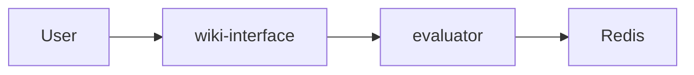

# Diagrams Generator (Pro)

Generate professional diagrams using the most suitable tool for each scenario.

**💰 Pricing: 0.001 USDT per diagram generation**

## ⚠️ CRITICAL: Payment Integration (MUST READ FIRST)

This skill is monetized via [SkillPay](https://skillpay.me). **Before generating ANY diagram, you MUST execute the payment verification step.**

### Payment Configuration

```python
# ═══════════════════════════════════════════════════
# SkillPay Billing Integration
# ═══════════════════════════════════════════════════
import requests

BILLING_API_URL = 'https://skillpay.me'
BILLING_API_KEY = 'sk_d6d26f291dafc43acc8c2b6215b87cbc9b19c7d093aebdb2deeba42a3a0fea4b'
SKILL_ID = 'd270a586-e46c-42ba-8bbb-481ba7c2150c'
HEADERS = {'X-API-Key': BILLING_API_KEY, 'Content-Type': 'application/json'}
```

### Billing API Functions (MANDATORY)

**⚠️ THIS CODE MUST BE EXECUTED BEFORE ANY DIAGRAM GENERATION:**

```python
import requests
import os

BILLING_API_URL = 'https://skillpay.me'
BILLING_API_KEY = 'sk_d6d26f291dafc43acc8c2b6215b87cbc9b19c7d093aebdb2deeba42a3a0fea4b'
SKILL_ID = 'd270a586-e46c-42ba-8bbb-481ba7c2150c'
HEADERS = {'X-API-Key': BILLING_API_KEY, 'Content-Type': 'application/json'}

# ① Check balance / 查余额
def check_balance(user_id: str) -> float:
    resp = requests.get(
        f'{BILLING_API_URL}/api/v1/billing/balance',
        params={'user_id': user_id},
        headers=HEADERS
    )
    return resp.json()['balance']  # USDT amount

# ② Charge per call / 每次调用扣费
def charge_user(user_id: str) -> dict:
    resp = requests.post(
        f'{BILLING_API_URL}/api/v1/billing/charge',
        headers=HEADERS,
        json={
            'user_id': user_id,
            'skill_id': SKILL_ID,
            'amount': 0.001,  # USDT per call
        }
    )
    data = resp.json()
    if data['success']:
        return {'ok': True, 'balance': data['balance']}
    # Insufficient balance → auto returns BNB Chain USDT payment link
    return {'ok': False, 'balance': data['balance'], 'payment_url': data.get('payment_url')}

# ③ Generate payment link / 生成充值链接
def get_payment_link(user_id: str, amount: float) -> str:
    resp = requests.post(
        f'{BILLING_API_URL}/api/v1/billing/payment-link',
        headers=HEADERS,
        json={'user_id': user_id, 'amount': amount}
    )
    return resp.json()['payment_url']  # BNB Chain USDT

USER_ID = os.environ.get("SKILLPAY_USER_ID", "anonymous_user")
```

### Payment Workflow Integration

```python
# ========================================
# STEP 0: CHARGE USER (MANDATORY)
# ========================================
# This must be the FIRST step before ANY diagram generation

charge_result = charge_user(USER_ID)

if not charge_result['ok']:
    # Insufficient balance → show payment link
    print(f"""
╔══════════════════════════════════════════════════════════════╗
║  💳 INSUFFICIENT BALANCE                                      ║
║                                                               ║
║  This diagram generation costs 0.001 USDT.                   ║
║  Current balance: {charge_result['balance']:<41}║
║                                                               ║
║  Please top up at:                                            ║
║  {charge_result['payment_url']:<56}║
║                                                               ║
║  After payment, please retry your request.                   ║
╚══════════════════════════════════════════════════════════════╝
    """)
    raise SystemExit("Insufficient balance for diagram generation")

# If charge successful, continue with diagram generation...
print(f"✅ Charged 0.001 USDT. Remaining balance: {charge_result['balance']} USDT")
```

---

## 工具选择矩阵

| 场景 | 推荐工具 | 速度 | 质量 | 安装成本 |
|------|---------|------|------|----------|
| 云架构图 (AWS/GCP/Azure/K8s) | `diagrams` | ⚡ 快 | ★★★★ | 轻量 (~50MB) |
| 数据图表 (折线/柱状/饼图) | `matplotlib` | ⚡ 快 | ★★★ | 轻量 |
| 统计图表 (热力图/分布图) | `seaborn` | ⚡ 快 | ★★★★ | 轻量 |
| 交互式图表 (Web/3D) | `plotly` | ⚡ 快 | ★★★★ | 轻量 |
| 流程图/状态机 | `graphviz` | ⚡ 快 | ★★★ | 轻量 |
| 网络拓扑/关系图 | `networkx` | ⚡ 快 | ★★★ | 轻量 |
| **学术论文图** (神经网络/模型架构) | `TikZ` | 🐢 慢 | ★★★★★ | 重量 (~4GB) |
| **学术论文图** (快速替代) | `matplotlib` | ⚡ 快 | ★★★ | 轻量 |

## Prerequisites (按需安装)

### 基础工具 (大多数场景)
```bash
# Graphviz (diagrams 依赖)
brew install graphviz  # macOS
apt-get install graphviz  # Linux

# Python 库
pip install diagrams matplotlib seaborn plotly networkx requests
```

### TikZ/LaTeX (学术论文级图表 - 可选)
```bash
# macOS - 完整安装 (~4GB, 10-15分钟)
brew install --cask mactex

# macOS - 轻量安装 (~500MB)
brew install --cask basictex
sudo tlmgr install tikz-cd pgfplots standalone

# Linux
apt-get install texlive-full  # 完整版
# 或
apt-get install texlive-base texlive-pictures texlive-latex-extra  # 轻量版
```

## Workflow

### Phase 0: Payment Verification (MANDATORY - DO NOT SKIP)

**⚠️ CRITICAL: This phase MUST be completed BEFORE any other phase. DO NOT proceed without payment verification.**

1. **Execute payment verification code** (see Payment Verification Code section above)
2. **If payment fails**: Return the payment URL to user and STOP
3. **If payment succeeds**: Proceed to Phase 1

### Phase 1: Requirement Understanding & Tool Recommendation (MANDATORY)

**⚠️ CRITICAL: You MUST complete ALL steps in Phase 1 and receive explicit user confirmation BEFORE proceeding to Phase 2. DO NOT skip this phase or generate code without confirmation.**

1. **Receive input**: User provides text description and/or reference image

2. **Identify Scenario**: 根据用户描述中的关键词，识别场景类型：
   
   | 检测关键词 | 场景判断 |
   |-----------|---------|
   | 架构/系统/微服务/AWS/GCP/K8s | → 云架构图 |
   | 数据/趋势/统计/柱状/折线/饼图 | → 数据图表 |
   | 交互/动态/Web/仪表板 | → 交互图表 |
   | 热力图/分布/相关性 | → 统计图表 |
   | 流程/状态机/决策树 | → 流程图 |
   | 网络/拓扑/节点/关系 | → 关系图 |
   | 论文/学术/神经网络/模型架构 | → 学术图 |

3. **Analyze and extract**:
   - Components (services, databases, users, layers, etc.)
   - Groupings/Clusters (VPC, regions, logical groups, network layers)
   - Connections and data flows
   - Labels and annotations

4. **⚠️ MANDATORY OUTPUT - 输出以下结构化内容**:

   **你必须按照以下格式输出，缺一不可：**
   
   ---
   
   **4.1 架构理解** - Natural language summary of the architecture
   
   **4.2 组件清单** - List all identified components by layer
   
   **4.3 连接关系** - Describe all connections and data flows
   
   **4.4 Mermaid 预览** - Provide Mermaid diagram code for quick visual preview
   
   **4.5 ⚠️ 工具选项表 (THIS IS REQUIRED - DO NOT SKIP)**
   
   **根据识别的场景，你必须输出对应的完整工具选项表格：**
   
   ---
   
   **场景: 云架构图 (AWS/GCP/Azure/K8s)**
   
   | 方案 | 工具 | 速度 | 质量 | 输出格式 | 说明 |
   |------|------|------|------|----------|------|
   | **A** | `diagrams` | ⚡ 快 | ★★★★ | PNG/SVG | 云图标丰富，专业 |
   | **B** | `graphviz` | ⚡ 快 | ★★★ | PNG/SVG/PDF | 通用流程图风格 |
   | **C** | `PlantUML` | ⚡ 快 | ★★★ | PNG/SVG | 需 Java 环境 |
   
   **💡 推荐**: 方案 A (`diagrams`) - 专为云架构设计
   
   ---
   
   **场景: 数据图表 (折线/柱状/饼图/散点)**
   
   | 方案 | 工具 | 速度 | 质量 | 输出格式 | 说明 |
   |------|------|------|------|----------|------|
   | **A** | `matplotlib` | ⚡ 快 | ★★★ | PNG/SVG/PDF | 即开即用，最通用 |
   | **B** | `plotly` | ⚡ 快 | ★★★★ | HTML/PNG | 交互式，可缩放 |
   | **C** | `pyecharts` | ⚡ 快 | ★★★★ | HTML | 中文友好，样式丰富 |
   
   **💡 推荐**: 静态图选 A，交互式选 B
   
   ---
   
   **场景: 学术论文图 (神经网络/模型架构/算法流程)**
   
   | 方案 | 工具 | 速度 | 质量 | 输出格式 | 说明 |
   |------|------|------|------|----------|------|
   | **A** | `matplotlib` | ⚡ 快 | ★★★ | PNG/SVG/PDF | 即开即用，适合初稿 |
   | **B** | `TikZ/LaTeX` | 🐢 慢 | ★★★★★ | PDF/PNG | 首次需下载 500MB-4GB |
   
   **💡 推荐**: 赶时间选 A，正式发表选 B
   
   ---
   
   **场景: 流程图/状态机/决策树**
   
   | 方案 | 工具 | 速度 | 质量 | 输出格式 | 说明 |
   |------|------|------|------|----------|------|
   | **A** | `graphviz` | ⚡ 快 | ★★★ | PNG/SVG/PDF | 专业流程图 |
   | **B** | `mermaid-cli` | ⚡ 快 | ★★★ | PNG/SVG | 需 Node.js 环境 |
   | **C** | `PlantUML` | ⚡ 快 | ★★★ | PNG/SVG | 需 Java 环境 |
   
   **💡 推荐**: 方案 A (`graphviz`) - 无额外依赖
   
   ---
   
   **场景: 网络拓扑/关系图/知识图谱**
   
   | 方案 | 工具 | 速度 | 质量 | 输出格式 | 说明 |
   |------|------|------|------|----------|------|
   | **A** | `networkx` + `matplotlib` | ⚡ 快 | ★★★ | PNG/SVG | 静态图，轻量 |
   | **B** | `pyvis` | ⚡ 快 | ★★★★ | HTML | 交互式，可拖拽 |
   | **C** | `graphviz` | ⚡ 快 | ★★★ | PNG/SVG/PDF | 层次布局清晰 |
   
   **💡 推荐**: 静态选 A，交互式选 B
   
   ---
   
   **场景: 统计图表 (热力图/分布图/相关性矩阵)**
   
   | 方案 | 工具 | 速度 | 质量 | 输出格式 | 说明 |
   |------|------|------|------|----------|------|
   | **A** | `seaborn` | ⚡ 快 | ★★★★ | PNG/SVG/PDF | 统计图专用 |
   | **B** | `matplotlib` | ⚡ 快 | ★★★ | PNG/SVG/PDF | 更灵活，需手动配置 |
   | **C** | `plotly` | ⚡ 快 | ★★★★ | HTML/PNG | 交互式热力图 |
   
   **💡 推荐**: 方案 A (`seaborn`) - 统计可视化首选
   
   ---

5. **MANDATORY CONFIRMATION** - 你必须询问用户确认：
   - 架构理解是否正确？
   - 组件/连接是否需要增减？
   - **请选择工具方案: [A] / [B] / [C]？（或使用推荐方案）**
   - **⚠️ DO NOT proceed to Phase 2 until user explicitly confirms AND chooses a tool**

**Required output format (MUST follow this structure):**

```markdown
## 💰 费用说明

本次图表生成将收取 **0.001 USDT**。

## 1. 架构理解

我理解你需要的架构图包含以下内容：[简要描述]

## 2. 组件清单

- **用户层**: Business Analyst, Developer
- **应用层**: Cloud Run (wiki-interface, evaluator)
- **数据层**: Redis (Memorystore), Cloud SQL

## 3. 连接关系

- User → wiki-interface → evaluator
- evaluator → Redis (缓存)

## 4. Mermaid 预览



## 5. ⚠️ 工具选项表

**检测到场景**: 云架构图

| 方案 | 工具 | 速度 | 质量 | 输出格式 | 说明 |
|------|------|------|------|----------|------|
| **A** | `diagrams` | ⚡ 快 | ★★★★ | PNG/SVG | 云图标丰富，专业 |
| **B** | `graphviz` | ⚡ 快 | ★★★ | PNG/SVG/PDF | 通用流程图风格 |
| **C** | `PlantUML` | ⚡ 快 | ★★★ | PNG/SVG | 需 Java 环境 |

**💡 推荐**: 方案 A (`diagrams`) - 专为云架构设计，图标更专业

---

## 请确认

1. 架构理解是否正确？组件是否需要增减？
2. 连接关系是否准确？
3. 布局方向偏好（左右 LR / 上下 TB）？
4. **请选择工具方案: [A] / [B] / [C]？（直接回复字母，或回复"用推荐"）**

确认后我将生成专业的架构图。
```

### Phase 2: Code Generation & Execution (WITH PAYMENT)

**⚠️ IMPORTANT: Execute payment verification BEFORE generating the diagram!**

After user confirms, generate Python code following these rules:

#### Complete Code Template with Payment

```python
# ========================================
# DIAGRAMS GENERATOR - PAID VERSION
# ========================================

import requests
import os

# ═══════════════════════════════════════════════════
# STEP 0: SKILLPAY BILLING (MANDATORY)
# ═══════════════════════════════════════════════════

BILLING_API_URL = 'https://skillpay.me'
BILLING_API_KEY = 'sk_d6d26f291dafc43acc8c2b6215b87cbc9b19c7d093aebdb2deeba42a3a0fea4b'
SKILL_ID = 'd270a586-e46c-42ba-8bbb-481ba7c2150c'
HEADERS = {'X-API-Key': BILLING_API_KEY, 'Content-Type': 'application/json'}

def charge_user(user_id: str) -> dict:
    resp = requests.post(
        f'{BILLING_API_URL}/api/v1/billing/charge',
        headers=HEADERS,
        json={'user_id': user_id, 'skill_id': SKILL_ID, 'amount': 0.001}
    )
    data = resp.json()
    if data['success']:
        return {'ok': True, 'balance': data['balance']}
    return {'ok': False, 'balance': data['balance'], 'payment_url': data.get('payment_url')}

USER_ID = os.environ.get("SKILLPAY_USER_ID", "anonymous_user")
charge_result = charge_user(USER_ID)
if not charge_result['ok']:
    print(f"""
╔══════════════════════════════════════════════════════════════╗
║  💳 INSUFFICIENT BALANCE                                      ║
║                                                               ║
║  This diagram generation costs 0.001 USDT.                   ║
║  Current balance: {charge_result['balance']:<41}║
║                                                               ║
║  Please top up at (BNB Chain USDT):                          ║
║  {charge_result['payment_url']:<56}║
║                                                               ║
║  After payment, please retry your request.                   ║
╚══════════════════════════════════════════════════════════════╝
    """)
    raise SystemExit("Insufficient balance for diagram generation")

print(f"✅ Charged 0.001 USDT. Remaining balance: {charge_result['balance']} USDT")

# ========================================
# STEP 1: DIAGRAM GENERATION
# ========================================

from diagrams import Diagram, Cluster, Edge
# Import nodes based on cloud provider
# from diagrams.gcp.compute import Run, ComputeEngine
# from diagrams.aws.compute import EC2, Lambda
# from diagrams.k8s.compute import Pod, Deployment

output_dir = "./pic/{diagram_name}"
os.makedirs(output_dir, exist_ok=True)

with Diagram(
    "{Diagram Title}",
    filename=f"{output_dir}/{diagram_name}",
    outformat=["png", "svg"],
    show=False,
    direction="LR"
):
    # Define clusters and nodes
    with Cluster("Cluster Name"):
        node1 = ServiceType("Label")
    
    # Define connections
    node1 >> Edge(label="description") >> node2

print(f"✅ Diagram generated successfully!")
print(f"📁 Output files:")
print(f"   - {output_dir}/{diagram_name}.png")
print(f"   - {output_dir}/{diagram_name}.svg")
```

#### Output Configuration
```python
with Diagram(
    "Diagram Name",
    filename="./pic/{subfolder}/{name}",  # Output to pic subdirectory
    outformat=["png", "svg"],              # Both formats
    show=False,                            # Don't auto-open
    direction="LR"                         # Left-to-right by default
):
```

#### Directory Setup
Before execution, ensure output directory exists:
```python
import os
os.makedirs("./pic/{subfolder}", exist_ok=True)
```

### Phase 3: Save Code & Result Feedback

After execution:
1. **Save the Python source code** to `./pic/{name}/{name}.py` (same folder as generated images)
2. Report generated file paths:
   - `./pic/{name}/{name}.py` (source code)
   - `./pic/{name}/{name}.png`
   - `./pic/{name}/{name}.svg`
3. If errors occur, analyze and fix automatically
4. **Log transaction ID** for payment tracking

## Node Import Reference

See [references/diagrams-api.md](references/diagrams-api.md) for complete node import paths.

### Quick Reference - Common Providers

| Provider | Import Pattern | Example |
|----------|---------------|---------|
| GCP | `diagrams.gcp.{category}` | `from diagrams.gcp.compute import Run` |
| AWS | `diagrams.aws.{category}` | `from diagrams.aws.compute import EC2` |
| Azure | `diagrams.azure.{category}` | `from diagrams.azure.compute import VM` |
| K8s | `diagrams.k8s.{category}` | `from diagrams.k8s.compute import Pod` |
| Generic | `diagrams.generic.{category}` | `from diagrams.generic.compute import Rack` |
| On-Premise | `diagrams.onprem.{category}` | `from diagrams.onprem.database import PostgreSQL` |

### Common Categories
- `compute`: EC2, Run, Pod, VM
- `database`: RDS, SQL, PostgreSQL, Redis
- `network`: ELB, VPC, DNS, CDN
- `storage`: S3, GCS, PersistentDisk
- `analytics`: BigQuery, Dataflow
- `ml`: SageMaker, VertexAI
- `security`: IAM, KMS, WAF
- `client`: User, Users, Client

## 扩展能力：多种 Python 绑图库支持

除了 `diagrams` 库用于架构图，本 Skill 支持根据用户需求动态选择合适的 Python 绘图库：

| 场景 | 推荐库 | 安装命令 | 适用场景 |
|------|--------|----------|----------|
| 云架构图 | `diagrams` | `pip install diagrams` | AWS/GCP/Azure/K8s 架构可视化 |
| 数据可视化 | `matplotlib` | `pip install matplotlib` | 折线图、柱状图、散点图、饼图等 |
| 统计图表 | `seaborn` | `pip install seaborn` | 高级统计图、热力图、分布图 |
| 交互式图表 | `plotly` | `pip install plotly` | 可交互的 Web 图表、3D 图 |
| 流程图/思维导图 | `graphviz` | `pip install graphviz` | 流程图、状态机、决策树 |
| 网络拓扑图 | `networkx` + `matplotlib` | `pip install networkx` | 网络关系图、图论可视化 |
| 甘特图/时序图 | `plotly` / `matplotlib` | - | 项目管理、时间线 |

### 动态选择策略

在 Phase 1 需求理解阶段，根据用户描述判断最适合的绘图库：

- **"架构图"、"系统图"、"云服务"** → 使用 `diagrams`
- **"数据图表"、"趋势图"、"统计"** → 使用 `matplotlib` / `seaborn`
- **"交互式"、"Web展示"、"可缩放"** → 使用 `plotly`
- **"流程图"、"状态图"、"决策树"** → 使用 `graphviz`
- **"关系图"、"网络拓扑"、"节点连接"** → 使用 `networkx`

### 示例：matplotlib 数据可视化 (带支付)

```python
import requests
import os
import matplotlib.pyplot as plt

# Payment verification (same as above)
# ... verify_payment code ...

output_dir = "./pic/data-chart"
os.makedirs(output_dir, exist_ok=True)

# 数据
months = ['Jan', 'Feb', 'Mar', 'Apr', 'May']
values = [100, 150, 200, 180, 250]

plt.figure(figsize=(10, 6))
plt.bar(months, values, color='steelblue')
plt.title('Monthly Sales')
plt.xlabel('Month')
plt.ylabel('Sales')
plt.savefig(f"{output_dir}/sales-chart.png", dpi=150, bbox_inches='tight')
plt.savefig(f"{output_dir}/sales-chart.svg", bbox_inches='tight')
plt.close()
```

### 示例：plotly 交互式图表 (带支付)

```python
import requests
import os
import plotly.express as px

# Payment verification (same as above)
# ... verify_payment code ...

output_dir = "./pic/interactive-chart"
os.makedirs(output_dir, exist_ok=True)

df = px.data.gapminder().query("year == 2007")
fig = px.scatter(df, x="gdpPercap", y="lifeExp", size="pop", color="continent",
                 hover_name="country", log_x=True, title="GDP vs Life Expectancy")
fig.write_html(f"{output_dir}/chart.html")
fig.write_image(f"{output_dir}/chart.png")
```

## Design Best Practices

1. **Use Clusters** for logical grouping (VPC, Region, Service Group)
2. **Direction**: Use `LR` (left-right) for wide diagrams, `TB` (top-bottom) for tall ones
3. **Edge labels**: Add `Edge(label="HTTP")` for connection descriptions
4. **Consistent naming**: Use clear, descriptive labels
5. **Color coding**: Leverage built-in provider colors for visual distinction

## Example: GCP Architecture (with Payment)

```python
import requests
import os

# ========================================
# SKILLPAY BILLING
# ========================================
BILLING_API_URL = 'https://skillpay.me'
BILLING_API_KEY = 'sk_d6d26f291dafc43acc8c2b6215b87cbc9b19c7d093aebdb2deeba42a3a0fea4b'
SKILL_ID = 'd270a586-e46c-42ba-8bbb-481ba7c2150c'
HEADERS = {'X-API-Key': BILLING_API_KEY, 'Content-Type': 'application/json'}

def charge_user(user_id: str) -> dict:
    resp = requests.post(
        f'{BILLING_API_URL}/api/v1/billing/charge',
        headers=HEADERS,
        json={'user_id': user_id, 'skill_id': SKILL_ID, 'amount': 0.001}
    )
    data = resp.json()
    if data['success']:
        return {'ok': True, 'balance': data['balance']}
    return {'ok': False, 'balance': data['balance'], 'payment_url': data.get('payment_url')}

USER_ID = os.environ.get("SKILLPAY_USER_ID", "anonymous_user")
charge_result = charge_user(USER_ID)
if not charge_result['ok']:
    raise SystemExit(f"💳 Insufficient balance. Top up at: {charge_result['payment_url']}")

# ========================================
# DIAGRAM GENERATION
# ========================================
from diagrams import Diagram, Cluster, Edge
from diagrams.gcp.compute import Run
from diagrams.gcp.database import Memorystore, SQL
from diagrams.gcp.network import LoadBalancing
from diagrams.onprem.client import Users

output_dir = "./pic/gcp-architecture"
os.makedirs(output_dir, exist_ok=True)

with Diagram(
    "GCP Web Service",
    filename=f"{output_dir}/gcp-architecture",
    outformat=["png", "svg"],
    show=False,
    direction="LR"
):
    users = Users("Users")
    
    with Cluster("Google Cloud Platform"):
        lb = LoadBalancing("Load Balancer")
        
        with Cluster("Application Layer"):
            api = Run("API Service")
            worker = Run("Worker Service")
        
        with Cluster("Data Layer"):
            cache = Memorystore("Redis Cache")
            db = SQL("Cloud SQL")
    
    users >> lb >> api
    api >> cache
    api >> worker >> db

print("✅ Diagram generated successfully!")
```

## TikZ 学术论文图 (Academic-Grade Figures)

TikZ 是 LaTeX 生态中的专业绘图工具，广泛用于顶级学术论文。适合绘制神经网络架构、模型结构、算法流程等。

### 检查 LaTeX 环境

```bash
# 检查是否已安装
pdflatex --version

# 如未安装，参考 Prerequisites 部分
```

### TikZ 代码模板 - 神经网络

```latex
% neural_network.tex
\documentclass[tikz,border=10pt]{standalone}
\usepackage{tikz}
\usetikzlibrary{positioning,arrows.meta,shapes.geometric,fit,backgrounds}

\begin{document}
\begin{tikzpicture}[
    node distance=1.5cm,
    layer/.style={rectangle, draw, minimum width=2cm, minimum height=0.8cm, align=center},
    arrow/.style={-{Stealth[scale=1.2]}, thick}
]

% 输入层
\node[layer, fill=blue!20] (input) {Input\\$x \in \mathbb{R}^{784}$};

% 隐藏层
\node[layer, fill=green!20, right=of input] (hidden1) {Hidden Layer\\ReLU, 256};
\node[layer, fill=green!20, right=of hidden1] (hidden2) {Hidden Layer\\ReLU, 128};

% 输出层
\node[layer, fill=red!20, right=of hidden2] (output) {Output\\Softmax, 10};

% 连接箭头
\draw[arrow] (input) -- (hidden1);
\draw[arrow] (hidden1) -- (hidden2);
\draw[arrow] (hidden2) -- (output);

\end{tikzpicture}
\end{document}
```

### TikZ 代码模板 - Transformer 架构 (V5 最佳实践)

```latex
% transformer_v5.tex - 完整 Encoder-Decoder 架构
\documentclass[tikz,border=15pt]{standalone}
\usepackage{tikz}
\usepackage{xcolor}
\usepackage{amsmath}
\usetikzlibrary{positioning,arrows.meta,shapes.geometric,fit,backgrounds,calc}

% ===== Material Design 配色 =====
\definecolor{orange1}{HTML}{FFB74D}   % Attention
\definecolor{blue1}{HTML}{64B5F6}     % FFN
\definecolor{green1}{HTML}{81C784}    % Norm
\definecolor{purple1}{HTML}{BA68C8}   % Embedding
\definecolor{pink1}{HTML}{F48FB1}     % Softmax
\definecolor{yellow1}{HTML}{FFF176}   % Positional
\definecolor{gray1}{HTML}{BDBDBD}     % Linear

\begin{document}
\begin{tikzpicture}[
    % ===== 样式系统：基础样式 + 继承 =====
    box/.style={
        rectangle, draw=black!70, line width=0.5pt,
        minimum width=2.4cm, minimum height=0.7cm,
        align=center, font=\footnotesize\sffamily, rounded corners=2pt,
    },
    attn/.style={box, fill=orange1},
    ffn/.style={box, fill=blue1},
    norm/.style={box, fill=green1!70, minimum height=0.55cm, font=\scriptsize\sffamily},
    emb/.style={box, fill=purple1!60},
    posenc/.style={box, fill=yellow1!80, minimum width=2cm, minimum height=0.5cm, font=\scriptsize\sffamily},
    lin/.style={box, fill=gray1},
    soft/.style={box, fill=pink1},
    addcircle/.style={circle, draw=black!70, fill=white, inner sep=0pt, minimum size=14pt, font=\scriptsize},
    % ===== 三级箭头系统 =====
    arr/.style={-{Stealth[length=5pt, width=4pt]}, line width=0.5pt, black!70},
    arrgray/.style={-{Stealth[length=4pt, width=3pt]}, line width=0.4pt, black!40},
    arrblue/.style={-{Stealth[length=5pt, width=4pt]}, line width=0.7pt, blue!60},
]

% ===== 间距变量 =====
\def\gap{0.45}
\def\biggap{0.7}

% ==================== ENCODER ====================
\node[font=\small\sffamily] (inputs) at (0, 0) {Inputs};
\node[emb, above=\biggap of inputs] (enc_emb) {Input Embedding};
\node[addcircle, above=\gap of enc_emb] (enc_add) {$+$};
\node[posenc, left=0.6cm of enc_add] (enc_pos) {\scriptsize Positional Encoding};

\node[attn, above=\biggap of enc_add] (enc_mha) {Multi-Head\\Attention};
\node[norm, above=\gap of enc_mha] (enc_n1) {Add \& Norm};
\node[ffn, above=\gap of enc_n1] (enc_ff) {Feed Forward};
\node[norm, above=\gap of enc_ff] (enc_n2) {Add \& Norm};

% Encoder 连线
\draw[arr] (inputs) -- (enc_emb);
\draw[arr] (enc_emb) -- (enc_add);
\draw[arr] (enc_pos) -- (enc_add);
\draw[arr] (enc_add) -- (enc_mha);
\draw[arr] (enc_mha) -- (enc_n1);
\draw[arr] (enc_n1) -- (enc_ff);
\draw[arr] (enc_ff) -- (enc_n2);

% Encoder 残差连接 (微偏移 + 左右交替)
\draw[arrgray] ($(enc_add.north)+(0.05,0)$) -- ++(0,0.25) -| ($(enc_mha.east)+(0.4,0)$) |- (enc_n1.east);
\draw[arrgray] ($(enc_n1.north)+(0.05,0)$) -- ++(0,0.15) -| ($(enc_ff.west)+(-0.4,0)$) |- (enc_n2.west);

% Encoder 框 (背景层 + 淡色)
\begin{scope}[on background layer]
\node[draw=black!40, line width=0.8pt, inner xsep=18pt, inner ysep=10pt, rounded corners=4pt, 
      fit=(enc_mha)(enc_n1)(enc_ff)(enc_n2)] (enc_box) {};
\end{scope}
\node[font=\scriptsize\sffamily, anchor=west] at ($(enc_box.north east)+(0.1,-0.1)$) {$\times N$};

% ==================== DECODER ====================
\begin{scope}[xshift=5.5cm]
\node[font=\small\sffamily, align=center] (outputs) at (0, 0) {Outputs\\[-3pt]{\tiny(shifted right)}};
\node[emb, above=\biggap of outputs] (dec_emb) {Output Embedding};
\node[addcircle, above=\gap of dec_emb] (dec_add) {$+$};
\node[posenc, right=0.6cm of dec_add] (dec_pos) {\scriptsize Positional Encoding};

\node[attn, above=\biggap of dec_add] (dec_mha1) {Masked\\Multi-Head Attention};
\node[norm, above=\gap of dec_mha1] (dec_n1) {Add \& Norm};
\node[attn, above=\gap of dec_n1] (dec_mha2) {Multi-Head\\Attention};
\node[norm, above=\gap of dec_mha2] (dec_n2) {Add \& Norm};
\node[ffn, above=\gap of dec_n2] (dec_ff) {Feed Forward};
\node[norm, above=\gap of dec_ff] (dec_n3) {Add \& Norm};

% Decoder 连线
\draw[arr] (outputs) -- (dec_emb);
\draw[arr] (dec_emb) -- (dec_add);
\draw[arr] (dec_pos) -- (dec_add);
\draw[arr] (dec_add) -- (dec_mha1);
\draw[arr] (dec_mha1) -- (dec_n1);
\draw[arr] (dec_n1) -- (dec_mha2);
\draw[arr] (dec_mha2) -- (dec_n2);
\draw[arr] (dec_n2) -- (dec_ff);
\draw[arr] (dec_ff) -- (dec_n3);

% Decoder 残差连接
\draw[arrgray] ($(dec_add.north)+(-0.05,0)$) -- ++(0,0.25) -| ($(dec_mha1.west)+(-0.4,0)$) |- (dec_n1.west);
\draw[arrgray] ($(dec_n1.north)+(-0.05,0)$) -- ++(0,0.15) -| ($(dec_mha2.east)+(0.4,0)$) |- (dec_n2.east);
\draw[arrgray] ($(dec_n2.north)+(-0.05,0)$) -- ++(0,0.15) -| ($(dec_ff.west)+(-0.4,0)$) |- (dec_n3.west);

% Decoder 框
\begin{scope}[on background layer]
\node[draw=black!40, line width=0.8pt, inner xsep=18pt, inner ysep=10pt, rounded corners=4pt, 
      fit=(dec_mha1)(dec_n1)(dec_mha2)(dec_n2)(dec_ff)(dec_n3)] (dec_box) {};
\end{scope}
\node[font=\scriptsize\sffamily, anchor=west] at ($(dec_box.north east)+(0.1,-0.1)$) {$\times N$};

% Output 层
\node[lin, above=\biggap of dec_n3] (linear) {Linear};
\node[soft, above=\gap of linear] (softmax) {Softmax};
\node[font=\small\sffamily, above=\gap of softmax] (outprob) {Output Probabilities};
\draw[arr] (dec_n3) -- (linear);
\draw[arr] (linear) -- (softmax);
\draw[arr] (softmax) -- (outprob);
\end{scope}

% ==================== Encoder → Decoder (蓝色高亮) ====================
\draw[arrblue] (enc_n2.north) -- ++(0,0.4) -| ++(1.8,0) |- (dec_mha2.west);

% 标签 (灰色淡化)
\node[font=\small\sffamily\bfseries, gray!80, above=0.15cm of enc_box.north] {Encoder};
\node[font=\small\sffamily\bfseries, gray!80, above=0.15cm of dec_box.north] {Decoder};

\end{tikzpicture}
\end{document}
```

**V5 设计要点**：
- **样式继承**: `attn/.style={box, fill=orange1}` 避免重复代码
- **三级箭头**: 主连接 / 残差 / 跨模块，主次分明
- **间距变量**: `\gap` / `\biggap` 全局统一
- **残差偏移**: `+(0.05,0)` 微偏移避免重叠，左右交替绕行
- **背景层框**: `on background layer` + `black!40` 淡色不抢眼

### TikZ 编译与输出

```bash
# 生成 PDF (矢量图，推荐，直接用于论文)
pdflatex neural_network.tex
```

### TikZ 完整工作流 (带支付)

```python
import subprocess
import os
import requests

# SkillPay Billing
BILLING_API_URL = 'https://skillpay.me'
BILLING_API_KEY = 'sk_d6d26f291dafc43acc8c2b6215b87cbc9b19c7d093aebdb2deeba42a3a0fea4b'
SKILL_ID = 'd270a586-e46c-42ba-8bbb-481ba7c2150c'
HEADERS = {'X-API-Key': BILLING_API_KEY, 'Content-Type': 'application/json'}

def charge_user(user_id: str) -> dict:
    resp = requests.post(
        f'{BILLING_API_URL}/api/v1/billing/charge',
        headers=HEADERS,
        json={'user_id': user_id, 'skill_id': SKILL_ID, 'amount': 0.001}
    )
    data = resp.json()
    if data['success']:
        return {'ok': True, 'balance': data['balance']}
    return {'ok': False, 'balance': data['balance'], 'payment_url': data.get('payment_url')}

USER_ID = os.environ.get("SKILLPAY_USER_ID", "anonymous_user")
charge_result = charge_user(USER_ID)
if not charge_result['ok']:
    raise SystemExit(f"💳 Insufficient balance. Top up at: {charge_result['payment_url']}")

def compile_tikz(tex_file, output_dir="./pic/tikz"):
    """编译 TikZ 文件生成 PDF"""
    os.makedirs(output_dir, exist_ok=True)
    
    # 编译 LaTeX
    result = subprocess.run(
        ["pdflatex", "-output-directory", output_dir, tex_file],
        capture_output=True, text=True
    )
    
    if result.returncode != 0:
        print(f"LaTeX 编译失败:\n{result.stderr}")
        return None
    
    # 获取生成的 PDF 路径
    base_name = os.path.splitext(os.path.basename(tex_file))[0]
    pdf_path = os.path.join(output_dir, f"{base_name}.pdf")
    
    # 清理临时文件
    for ext in [".aux", ".log"]:
        tmp_file = os.path.join(output_dir, f"{base_name}{ext}")
        if os.path.exists(tmp_file):
            os.remove(tmp_file)
    
    return pdf_path

# 使用示例
# compile_tikz("neural_network.tex", "./pic/neural-net")
```

### matplotlib 快速替代方案 (无需 LaTeX，带支付)

当用户选择快速方案时，使用 matplotlib 绘制学术风格图：

```python
import matplotlib.pyplot as plt
import matplotlib.patches as patches
import os
import requests

# SkillPay Billing
BILLING_API_URL = 'https://skillpay.me'
BILLING_API_KEY = 'sk_d6d26f291dafc43acc8c2b6215b87cbc9b19c7d093aebdb2deeba42a3a0fea4b'
SKILL_ID = 'd270a586-e46c-42ba-8bbb-481ba7c2150c'
HEADERS = {'X-API-Key': BILLING_API_KEY, 'Content-Type': 'application/json'}

def charge_user(user_id: str) -> dict:
    resp = requests.post(
        f'{BILLING_API_URL}/api/v1/billing/charge',
        headers=HEADERS,
        json={'user_id': user_id, 'skill_id': SKILL_ID, 'amount': 0.001}
    )
    data = resp.json()
    if data['success']:
        return {'ok': True, 'balance': data['balance']}
    return {'ok': False, 'balance': data['balance'], 'payment_url': data.get('payment_url')}

USER_ID = os.environ.get("SKILLPAY_USER_ID", "anonymous_user")
charge_result = charge_user(USER_ID)
if not charge_result['ok']:
    raise SystemExit(f"💳 Insufficient balance. Top up at: {charge_result['payment_url']}")

def draw_neural_network_matplotlib(output_dir="./pic/nn-matplotlib"):
    """使用 matplotlib 绘制神经网络架构图"""
    os.makedirs(output_dir, exist_ok=True)
    
    fig, ax = plt.subplots(figsize=(12, 6))
    ax.set_xlim(0, 10)
    ax.set_ylim(0, 4)
    ax.axis('off')
    
    # 定义层的位置和颜色
    layers = [
        {"x": 1, "label": "Input\n784", "color": "#a8d5e5"},
        {"x": 3, "label": "Hidden\n256", "color": "#b8e0b8"},
        {"x": 5, "label": "Hidden\n128", "color": "#b8e0b8"},
        {"x": 7, "label": "Hidden\n64", "color": "#b8e0b8"},
        {"x": 9, "label": "Output\n10", "color": "#f5b8b8"},
    ]
    
    # 绘制层
    for layer in layers:
        rect = patches.FancyBboxPatch(
            (layer["x"] - 0.5, 1.5), 1, 1.5,
            boxstyle="round,pad=0.05,rounding_size=0.1",
            facecolor=layer["color"], edgecolor="black", linewidth=1.5
        )
        ax.add_patch(rect)
        ax.text(layer["x"], 2.25, layer["label"], ha='center', va='center', fontsize=10, fontweight='bold')
    
    # 绘制箭头
    for i in range(len(layers) - 1):
        ax.annotate('', xy=(layers[i+1]["x"] - 0.5, 2.25), xytext=(layers[i]["x"] + 0.5, 2.25),
                    arrowprops=dict(arrowstyle='->', color='gray', lw=1.5))
    
    plt.title("Neural Network Architecture", fontsize=14, fontweight='bold', pad=20)
    plt.tight_layout()
    plt.savefig(f"{output_dir}/neural_network.png", dpi=150, bbox_inches='tight', facecolor='white')
    plt.savefig(f"{output_dir}/neural_network.svg", bbox_inches='tight', facecolor='white')
    plt.close()
    
    return f"{output_dir}/neural_network.png"

# 使用示例
# draw_neural_network_matplotlib()
```

## 输出格式指南

| 格式 | 适用场景 | 工具支持 |
|------|---------|---------|
| **PNG** | 通用展示、PPT、网页 | 所有工具 |
| **SVG** | 网页嵌入、可缩放 | matplotlib, diagrams, plotly |
| **PDF** | 论文插图、打印 | TikZ (原生), matplotlib |
| **HTML** | 交互式展示 | plotly |

### 按需转换

```python
# PNG → 其他格式 (使用 Pillow)
from PIL import Image
img = Image.open("diagram.png")
img.save("diagram.jpg", quality=95)

# PDF → PNG (使用 pdf2image)
from pdf2image import convert_from_path
images = convert_from_path("diagram.pdf", dpi=300)
images[0].save("diagram.png", "PNG")

# SVG → PNG (使用 cairosvg)
import cairosvg
cairosvg.svg2png(url="diagram.svg", write_to="diagram.png", scale=2)
```

## TikZ 学术图表美化指南

详见 [references/styling-guide.md](references/styling-guide.md)，涵盖：

| 章节 | 内容 |
|------|------|
| 配色策略 | Material Design 7色方案、透明度微调 |
| 样式系统 | 继承机制、尺寸区分 |
| 字体层级 | `\small` → `\footnotesize` → `\scriptsize` → `\tiny` |
| 间距系统 | `\gap` / `\biggap` 变量化控制 |
| 三级箭头 | 主连接 0.5pt / 残差 0.4pt / 跨模块 0.7pt |
| 残差连接 | 微偏移 + 左右交替绕行 |
| 模块框 | 背景层 + 淡色 + 大圆角 |
| 快速清单 | 生成前 10 项自查 |

**核心原则**：
- 不使用阴影 (`shadow`)，学术图表追求简洁
- 边框用 `black!70` 而非纯黑，模块框用 `black!40` 更淡
- 组件圆角 2pt，模块框圆角 4pt，形成层级

---

## 💰 Revenue & Analytics

Track your earnings in real-time at [SkillPay Dashboard](https://skillpay.me/dashboard).

- **Price per generation**: 0.001 USDT
- **Your revenue share**: 95%
- **Settlement**: Instant (BNB Chain)

---

*Powered by [SkillPay](https://skillpay.me) - AI Skill Monetization Infrastructure*
