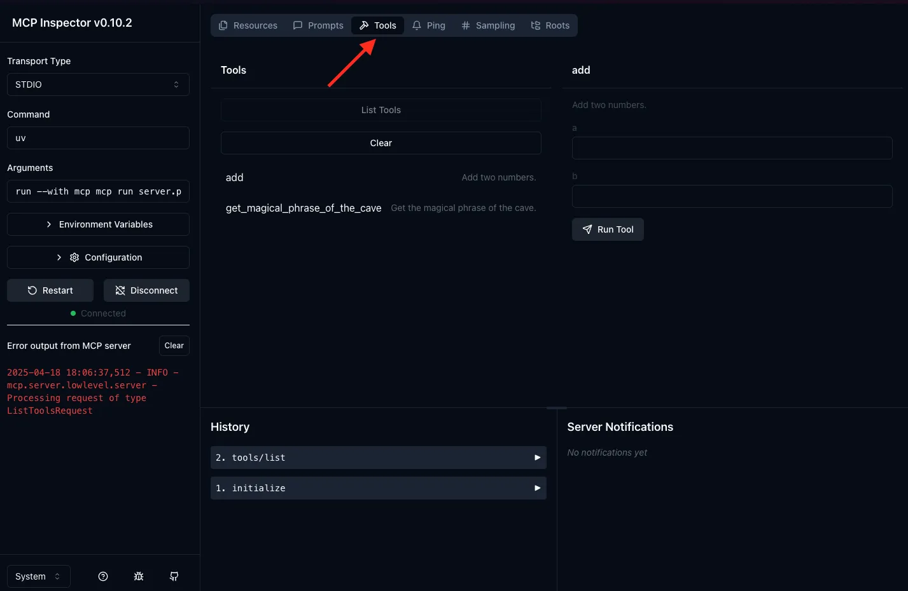

# How to Build Your Own MCP Server — Step by Step (Beginner Friendly)

Welcome! This guide is designed for researchers, scientists, and anyone with basic Python knowledge—even if you have no formal programming background. If you have some Python functions or scripts from your research, you can follow this guide to make them accessible to powerful AI models (LLMs) using the Model Context Protocol (MCP).

---

## What to Expect

This guide will walk you through:

1. **Setting up your environment** — installing the tools you need.
2. **Creating a basic MCP server** — start with a simple example.
3. **Adapting your own research code** — how to turn your scripts or functions into AI-accessible tools.
4. **Testing your server with MCP Inspector** — making sure it works.

---

## Prerequisites

- **Basic Python knowledge** (e.g., writing simple functions, running scripts)
- **Some functions or scripts** you use in your research, and would like the AI agent to use
- **Python >= 3.12** installed on your computer
<details>
<summary>How to check your Python version (step-by-step)</summary>

1. **Open your terminal:**

   - On **Mac**: Open the "Terminal" app  (find it with Spotlight or in Applications > Utilities).
   - On **Windows**: Open "Command Prompt" or "PowerShell"  (search for "cmd" or "PowerShell" in the Start menu).

2. **Type this command and press Enter:**

   ```bash
   python --version
   ```

   - If this doesn't work, try:

   ```bash
   python3 --version
   ```

3. **What you should see:**

   - The output should look like: `Python 3.12.2`
   - If the version is **3.12 or higher**, you're good to go!

4. **If you get an error or Python is not found:**
   - You may need to [download and install Python](https://www.python.org/downloads/).
   - After installing, close and reopen your terminal, then try again.

</details>

## Overview

Let's make a quick summary of what you actually need for letting a local agent use your tool through MCP protocol:

- A MCP server (e.g. `example-server` in this case) which is a python module (a `.py` file) that contains multiple tools and resources inside.
- A LLM client with MCP support, e.g.:
  - [Goose](https://block.github.io/goose/) (Open source, free)
  - [Claude Desktop](https://claude.ai/download) (Close source, by Claude, commercial)

their relationship is like:

<div align="center">

</div>

**Tools** are defined to enable servers to expose executable functionality to clients. Through tools, LLMs can interact with external systems, perform computations, and take actions in the real world.

**Resources** are defined to enable servers to expose data and content that can be read by clients and used as context for LLM interactions.

**Prompts** are defined to enable servers to define reusable prompt templates and workflows that clients can easily surface to users and LLMs. They provide a powerful way to standardize and share common LLM interactions.

For more details about architecture and core concepts, you can refer to [the official introduction](https://modelcontextprotocol.io/docs/concepts/architecture).

**Let's Get Started!**

## Step 1: Install `uv`

`uv` is a package manager for Python, we will use it to run the MCP server.

### macOS and Linux

Open Terminal , paste the following command, press 'Enter' to run:

```bash
curl -LsSf https://astral.sh/uv/install.sh | sh
```

<details>
<summary>👈 Cannot find the Terminal?</summary>

You can search for 'Terminal' in the Spotlight search (Cmd + Space) or Launchpad and open it.

</details>

### Windows

Open Powershell , paste the following command, press 'Enter' to run:

```powershell
powershell -ExecutionPolicy ByPass -c "irm https://astral.sh/uv/install.ps1 | iex"
```

<details>
<summary>👈 Cannot find the Powershell?</summary>

You can search for 'Powershell' in the Start menu (by pressing `Win` key and typing 'Powershell') or search bar and open it.

</details>

## Step 2: Set Up Your Server Folder

First, create a new folder somewhere for your server. You can simply do it in file manager.

Open this folder in terminal and set the `uv` environment

- For macOS:

  - Open Terminal  and `cd` to your folder. For example if your folder path is `/Users/your_user_name/Documents/example_server`, enter `cd /Users/your_user_name/Documents/example_server`.
  - You can also drag the folder into the terminal, add `cd` before the folder path and press 'Enter' to run
  - When you are in this folder, enter these commands orderly:
    ```bash
    uv init
    uv venv
    source .venv/bin/activate
    uv add mcp 'mcp[cli]'
    ```
    <div align="center">
    
    </div>

- For Windows:

  - Enter the folder, press 'Shift + Right Click' and select 'Open PowerShell'
  - Enter these commands orderly:
    ```powershell
    uv init
    uv venv
    .venv\Scripts\activate
    uv add mcp 'mcp[cli]'
    ```
    <div align="center">
    
    </div>

<br />
That's it! Your folder has been set up for you. You can now start adding your code.

## Step 3: Make a Simple MCP Server

As a simple example, let's say you have the following two python functions which you would like to convert into a tool that the AI agent can use. The first function returns a number and the second function returns an image. Of course the actual function will be much more complicated, but the procedure is the same.

```python

def add(a: int, b: int) -> TextContent:
    return a+b

def get_image_of_flower():
    image_base64 = "iVBORw0KGgoAAAANSUhEUgAAAB4AAAAeCAYAAAA7MK6iAAAAIGNIUk0AAHomAACAhAAA+gAAAIDoAAB1MAAA6mAAADqYAAAXcJy6UTwAAAAGYktHRAD/AP8A/6C9p5MAAAAJcEhZcwABGUAAARlAAYDjddQAAAAHdElNRQfpBBUNAgfLUoX1AAAAJXRFWHRkYXRlOmNyZWF0ZQAyMDI1LTA0LTIxVDEzOjAxOjU2KzAwOjAwMB5AXgAAACV0RVh0ZGF0ZTptb2RpZnkAMjAyNS0wNC0yMVQxMzowMTo1NiswMDowMEFD+OIAAAAodEVYdGRhdGU6dGltZXN0YW1wADIwMjUtMDQtMjFUMTM6MDI6MDcrMDA6MDAT9mfuAAAAMXRFWHRDb21tZW50AFBORyByZXNpemVkIHdpdGggaHR0cHM6Ly9lemdpZi5jb20vcmVzaXplXknb4gAAABJ0RVh0U29mdHdhcmUAZXpnaWYuY29toMOzWAAABr5JREFUSMell2uIXGcZx3/P+77nzJy57CXZXJu0m602lyam2mprESElm0YwCoJVC35T3C1IESEICuKlahBqKTUJCJovFvwgaLVUa4WGhoq2CYS01UQzm0u7SXez97mdmXPexw9nZzaJ7obS59MwZ87zf9///7n8R3ifMfbwKADqtfvd0F+O3vI9875A942AgKYKgtUkA68Mj9zyXVnpYTeBZr9Max5Xsmx58Qhj+0exOUNSTUH4BPB14BWEo0BiQsPg84ffO/DY/tHOTRyeIYRplGs3vJFdcCvwW+BuYA74LHAcWZny5an2miX2PAS8hPIcyvDmg0OE63PgQQwW+MYiKEAvcEC9ImZFMnHLcyGgCsIwsBnYbPLm2MSz448F63K/T6sp6ULyYeBzNzFwj1iJ1GsD4MKnH7sh7eAfD68MrKqIE9FUNwKIFcof79+Yuz06Ik5W9+1Zdeydn114BFjTEc31BQAbk9l2WQyNyvAIvulvELaydwRxsjywiHSkCFEwkSXcmMNEZgPKk/V/1SKU/QASCMUPlSnsKKNtLbeuNAut8SaN8/VNwMeAbcAM8DvgiiaaAY99ahRJFF3UJa2lRFuLVJ5+K12/9/Zml0ftnrzX5MwPJJCSeqX0kV6Ku3uyYyqhv+h3NM7VvoyRLwEfAILFFB9F+BrQNpV9I4hktSSBCIJbfWAtF58+ye5nH4zESR3Axx7fSLtnsL1Bv+t1QTRUpLCr3O2PdCHpq59Z+AUi30fZ3gXN4m6UPApOEHysIDzom/4rQP/8qzNv7/jlHifWbF91YN2dzfM1mufrtN9tEazPgYIJhPC2PNEHi4iTLhvNsXroY7/R9jjECb6e4uOuzidNKFWfKE5VwVBE+SGwBwUJDGIFDARrQ4K1IfmhAq0rMRorEgiIEG0r43pcF1SbHpMz9D+8BtvrEGdoT8bMvTyFr/urCMd8SxVZ6uNkUfxsQs0nNCv1pRZRCNblKGwrdSkVl5DbtIDk4qWCDA3R1hLh5jy27DAFiy05EEmBp7YcGvwHAiY0GPWAEgNPAG9ANnurr89Rf7O6KH4GLjmzSKtgy9OE6y4QDlxGTNptFwB89llbnvqZBXwt/RXCM2PfupD18vOHMcYJJjQAp4BHgT8gpL7pWfjbDHOvTJNca2XJAEQx+RomjPH1fsQlYBOun76aKu2rMXPHp2icq50Avg3UULoTTQAq+0ZwBdsZ+GWULwCP49mJgWBNSGFrkdyWIm5VnXDdGNrsJZm7DbdqDB9HtKc3oDE0z9ezQrzWyoaHMAk8ifAMSrXT966jY1JLrx98EwhT4aYc0V0lgrUhJm+RwEDqwBskaGBLE5iggQnrpNU+fFok3JAjmWnTmmh18q0BnkDZgXAQ5aq2FdtZfSYQNOUh4CngYGF76c6eT64m3JDH5DNtxYCmDt+KuuAmjNEkJFlYDd5hIktuU4Trc7Qnsi5AEGA3cAfCX4GGWyTc+paOAt9FGQgGAkr39mLyZqm4rgvf6MHXe8Ak2EIVTQI0DjuTC4D8UAExwtzxKXzDd3J8HuU1lJ+axdX3GeDHwECmgcl+6LNC8dWUjrvoFFhabZPOKmmtDx8XSeYSWu80l6pbITcYkR8q3LwG7pVArBMnVhN9BCh1XmpNxMy8MIktWXzL43oc5Qf6lypXofHvGsFAiO3PBojJGeZPTBOON4nuKia2J2j62Ed47CIPDeA0cETbmjoTiE8TvUzX4AAe355szbcmdEyMBIWtpZ2SN1lLGWiPx9TfrFK+r3exYRUTWUzeUj05R+Ncbbx8f9/j6UIizUq9DyEBLiOcQZkSJ7i04RXhJygngUGgDYwj/IeUCdvjjrqBcGfXd80mzP99lrSa+Na7sUTbSlnpGLAlmy2KahpNvzB5trir/E+sXH8l0lqKLdnuPp4GfnOzGGK4TxP/QFZgQjIZM//qDO2rMWLk160r8fr2RDwcbMhnbmVpbUYmb1Y1ztUYeun/+y633IPK3hEwsss3ff/C63O4sqN5sUE6n4BwCuE7yWz7joXXZu8p39+/xhYt7alWZpmy+rasEI6VwwDEFxrEHbqES8A3US4pXGq9Hf9odm7ykORMmMy2O5Q2UeZvmXjZEE4Ab3U0RHgD+Cqel8UIxgk4DqfV9HvJVHueJXt1FuHiSq592RubQEhjPSuGR8m88jzwHFDBgXaXMC0sh/CcAr5IZnF/jmdGAnnvwJoqNif4tp5GOd05vS0Y0obvmvXK8AgoKfAnsfKiejUoiTi54f/U/5J5i1jOF18fY/tH8bHPdjVLq2/Ln48sm/e/iK/xqR9oRdwAAAAASUVORK5CYII="
    # if you're not familiar with base64, you can see https://en.wikipedia.org/wiki/Base64
    return ImageContent(data=image_base64, mimeType="image/png", type="image")
```


To convert this into mcp server, replace the code in `main.py` with:

```python
from mcp.server.fastmcp import FastMCP
from mcp.types import TextContent, ImageContent, BlobResourceContents
import logging

# Set up logging (this just prints messages to your terminal for debugging)
logging.basicConfig(
    level=logging.INFO,
    format='%(asctime)s - %(levelname)s - %(name)s - %(message)s'
)
logger = logging.getLogger(__name__)

# Create the MCP server object
mcp = FastMCP()

# Here’s where you define your tools (functions the AI can use)
@mcp.tool()
def add(a: int, b: int) -> TextContent:
    """Add two numbers.

    Args:
        a: the first integer to be added
        b: the second integer to be added
    
    Return:
        The sum of the two integers, as a string."""
    return TextContent(type="text", text=str(a + b))

# The return format should be one of the types defined in mcp.types. The commonly used ones include TextContent, ImageContent, BlobResourceContents.
# In the case of a string, you can also directly use `return str(a + b)` which is equivalent to `return TextContent(type="text", text=str(a + b))`

@mcp.tool()
def get_image_of_flower():
    """Get an image of flower

    Return:
        Image of flower in png."""
    image_base64 = "iVBORw0KGgoAAAANSUhEUgAAAB4AAAAeCAYAAAA7MK6iAAAAIGNIUk0AAHomAACAhAAA+gAAAIDoAAB1MAAA6mAAADqYAAAXcJy6UTwAAAAGYktHRAD/AP8A/6C9p5MAAAAJcEhZcwABGUAAARlAAYDjddQAAAAHdElNRQfpBBUNAgfLUoX1AAAAJXRFWHRkYXRlOmNyZWF0ZQAyMDI1LTA0LTIxVDEzOjAxOjU2KzAwOjAwMB5AXgAAACV0RVh0ZGF0ZTptb2RpZnkAMjAyNS0wNC0yMVQxMzowMTo1NiswMDowMEFD+OIAAAAodEVYdGRhdGU6dGltZXN0YW1wADIwMjUtMDQtMjFUMTM6MDI6MDcrMDA6MDAT9mfuAAAAMXRFWHRDb21tZW50AFBORyByZXNpemVkIHdpdGggaHR0cHM6Ly9lemdpZi5jb20vcmVzaXplXknb4gAAABJ0RVh0U29mdHdhcmUAZXpnaWYuY29toMOzWAAABr5JREFUSMell2uIXGcZx3/P+77nzJy57CXZXJu0m602lyam2mprESElm0YwCoJVC35T3C1IESEICuKlahBqKTUJCJovFvwgaLVUa4WGhoq2CYS01UQzm0u7SXez97mdmXPexw9nZzaJ7obS59MwZ87zf9///7n8R3ifMfbwKADqtfvd0F+O3vI9875A942AgKYKgtUkA68Mj9zyXVnpYTeBZr9Max5Xsmx58Qhj+0exOUNSTUH4BPB14BWEo0BiQsPg84ffO/DY/tHOTRyeIYRplGs3vJFdcCvwW+BuYA74LHAcWZny5an2miX2PAS8hPIcyvDmg0OE63PgQQwW+MYiKEAvcEC9ImZFMnHLcyGgCsIwsBnYbPLm2MSz448F63K/T6sp6ULyYeBzNzFwj1iJ1GsD4MKnH7sh7eAfD68MrKqIE9FUNwKIFcof79+Yuz06Ik5W9+1Zdeydn114BFjTEc31BQAbk9l2WQyNyvAIvulvELaydwRxsjywiHSkCFEwkSXcmMNEZgPKk/V/1SKU/QASCMUPlSnsKKNtLbeuNAut8SaN8/VNwMeAbcAM8DvgiiaaAY99ahRJFF3UJa2lRFuLVJ5+K12/9/Zml0ftnrzX5MwPJJCSeqX0kV6Ku3uyYyqhv+h3NM7VvoyRLwEfAILFFB9F+BrQNpV9I4hktSSBCIJbfWAtF58+ye5nH4zESR3Axx7fSLtnsL1Bv+t1QTRUpLCr3O2PdCHpq59Z+AUi30fZ3gXN4m6UPApOEHysIDzom/4rQP/8qzNv7/jlHifWbF91YN2dzfM1mufrtN9tEazPgYIJhPC2PNEHi4iTLhvNsXroY7/R9jjECb6e4uOuzidNKFWfKE5VwVBE+SGwBwUJDGIFDARrQ4K1IfmhAq0rMRorEgiIEG0r43pcF1SbHpMz9D+8BtvrEGdoT8bMvTyFr/urCMd8SxVZ6uNkUfxsQs0nNCv1pRZRCNblKGwrdSkVl5DbtIDk4qWCDA3R1hLh5jy27DAFiy05EEmBp7YcGvwHAiY0GPWAEgNPAG9ANnurr89Rf7O6KH4GLjmzSKtgy9OE6y4QDlxGTNptFwB89llbnvqZBXwt/RXCM2PfupD18vOHMcYJJjQAp4BHgT8gpL7pWfjbDHOvTJNca2XJAEQx+RomjPH1fsQlYBOun76aKu2rMXPHp2icq50Avg3UULoTTQAq+0ZwBdsZ+GWULwCP49mJgWBNSGFrkdyWIm5VnXDdGNrsJZm7DbdqDB9HtKc3oDE0z9ezQrzWyoaHMAk8ifAMSrXT966jY1JLrx98EwhT4aYc0V0lgrUhJm+RwEDqwBskaGBLE5iggQnrpNU+fFok3JAjmWnTmmh18q0BnkDZgXAQ5aq2FdtZfSYQNOUh4CngYGF76c6eT64m3JDH5DNtxYCmDt+KuuAmjNEkJFlYDd5hIktuU4Trc7Qnsi5AEGA3cAfCX4GGWyTc+paOAt9FGQgGAkr39mLyZqm4rgvf6MHXe8Ak2EIVTQI0DjuTC4D8UAExwtzxKXzDd3J8HuU1lJ+axdX3GeDHwECmgcl+6LNC8dWUjrvoFFhabZPOKmmtDx8XSeYSWu80l6pbITcYkR8q3LwG7pVArBMnVhN9BCh1XmpNxMy8MIktWXzL43oc5Qf6lypXofHvGsFAiO3PBojJGeZPTBOON4nuKia2J2j62Ed47CIPDeA0cETbmjoTiE8TvUzX4AAe355szbcmdEyMBIWtpZ2SN1lLGWiPx9TfrFK+r3exYRUTWUzeUj05R+Ncbbx8f9/j6UIizUq9DyEBLiOcQZkSJ7i04RXhJygngUGgDYwj/IeUCdvjjrqBcGfXd80mzP99lrSa+Na7sUTbSlnpGLAlmy2KahpNvzB5trir/E+sXH8l0lqKLdnuPp4GfnOzGGK4TxP/QFZgQjIZM//qDO2rMWLk160r8fr2RDwcbMhnbmVpbUYmb1Y1ztUYeun/+y633IPK3hEwsss3ff/C63O4sqN5sUE6n4BwCuE7yWz7joXXZu8p39+/xhYt7alWZpmy+rasEI6VwwDEFxrEHbqES8A3US4pXGq9Hf9odm7ykORMmMy2O5Q2UeZvmXjZEE4Ab3U0RHgD+Cqel8UIxgk4DqfV9HvJVHueJXt1FuHiSq592RubQEhjPSuGR8m88jzwHFDBgXaXMC0sh/CcAr5IZnF/jmdGAnnvwJoqNif4tp5GOd05vS0Y0obvmvXK8AgoKfAnsfKiejUoiTi54f/U/5J5i1jOF18fY/tH8bHPdjVLq2/Ln48sm/e/iK/xqR9oRdwAAAAASUVORK5CYII="
    # if you're not familiar with base64, you can see https://en.wikipedia.org/wiki/Base64

    return ImageContent(data=image_base64, mimeType="image/png", type="image")


# This is the main entry point for your server
def main():
    logger.info('Starting your-new-server')
    mcp.run('stdio')

if __name__ == "__main__":
    main()
```


**Further explanation**

- The decorator `@mcp.tool()` tells MCP this function is a tool the AI can use.
- The docstring """Add two numbers...""" is the description that LLM will use as an instruction to use this tool, so it is important to clearly describes the tool and the variables. 
- The return format needs to be one of the required formats specified in `mcp.types`. The most commonly used ones are `TextContent` for text response, and `ImageContent` for image response. The LLM will receive this response after calling this tool. We will discuss later on more complicated situation, such as when the return of your code is a large file, or a specialized format that cannot be directly processed by LLM.
- The `main()` function starts your server.
- You can add more tools by writing more functions and decorating them with `@mcp.tool()`.

---

## Step 4: Run Your Server Locally

Now let’s start your server and see if it works!

In your terminal, run:

```bash
python main.py
```

You should see something like:

```
2025-04-01 09:58:42,666 - INFO - your_new_server - Starting your-new-server
```

That's it! Your server is now running. You can stop it by pressing `Ctrl + C`.

If you see an error, double-check your folder names and code.

## Step 5: Add Your Own Tools (Functions)

You can add as many tools as you like! Just define more functions and decorate them with `@mcp.tool()`.

**Example:**

```python
import numpy as np

@mcp.tool()
async def mean(a: int, b: int) -> str:
    """Return the mean of two numbers.

    Args:
        a: the first integer
        b: the second integer

    Return:
        The mean of these two integers, as a string
    """
    return str(np.mean([a, b]))
```

**To use your own code:**

- Copy your function into the file.
- Add `@mcp.tool()` above it.
- Both async and sync functions are supported.
- Provide clear docstrings for your functions to help LLM better understand what your tool does.
- You can use any libraries you normally use (numpy, pandas, etc.). (Recommended to use `uv add` to install packages)

```bash
uv add <package-name>
```

### Use MCP Inspector to test your tools (No LLM Needed)

```bash
mcp dev main.py
```

You will see output like this:

<div align="center">

</div>

Open the link in your browser and you will see the MCP Inspector interface.
Click 'Connect' on the left to connect to your server.

You can now check and test your tools in 'Tools' tab.

<div align="center">


</div>

---

By now, you’ve now made your own MCP server.

---

# Still Stuck?

If you're still having trouble, don't worry! [Create a new issue](https://github.com/pathintegral-institute/mcp.science/issues/new) on this repo and we'll be glad to help you.

# What’s Next?

Now that you have built your own MCP server, the next step is to connect it to an LLM client (like Claude Desktop, Goose, or others) so you can use your tools in real conversations.

👉 **Continue to the next guide:** [How to integrate your MCP server into an LLM client](./integrate-mcp-server-step-by-step.md)

This guide will walk you through adding your server to your favorite client and making sure everything works smoothly.
