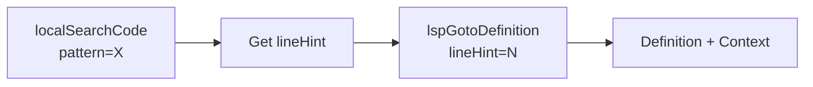
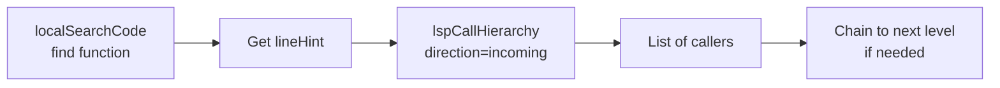
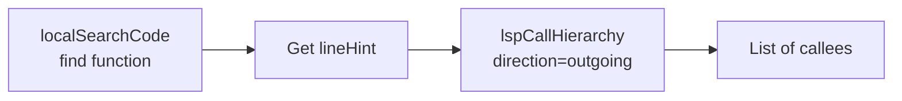
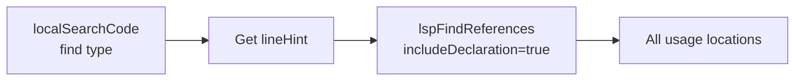
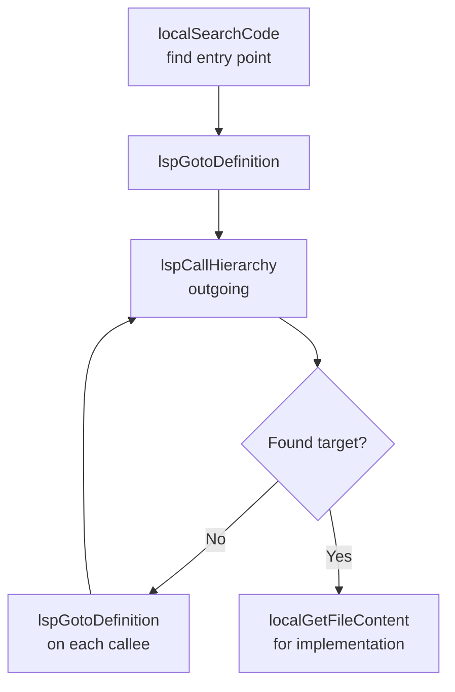
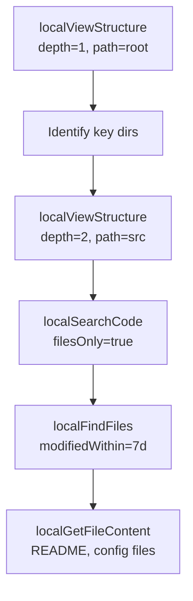
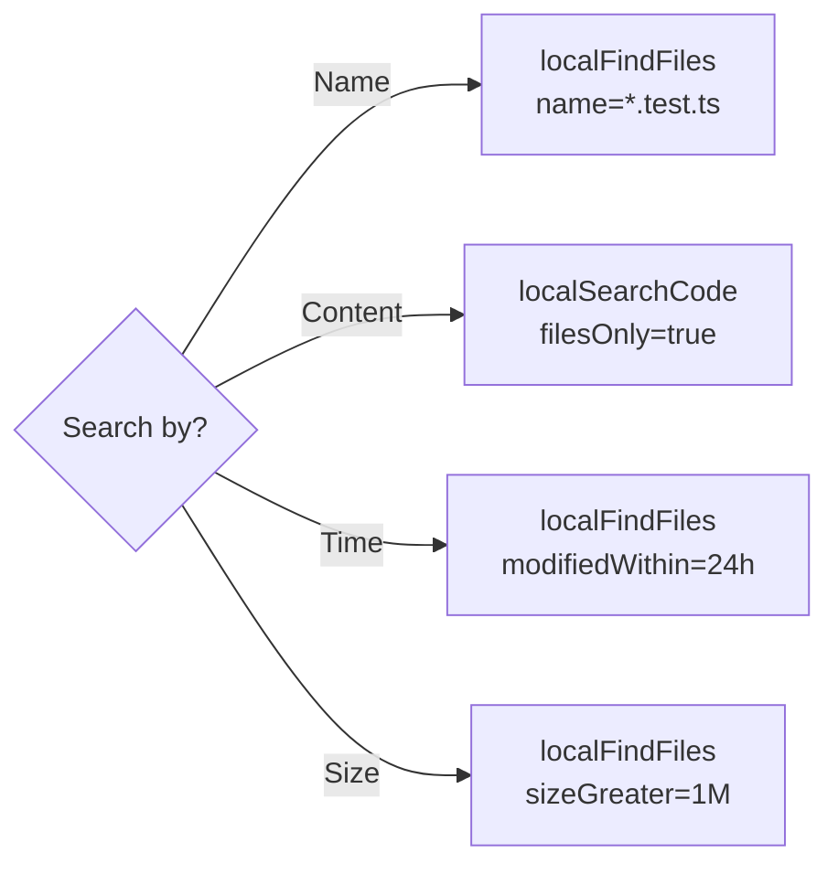
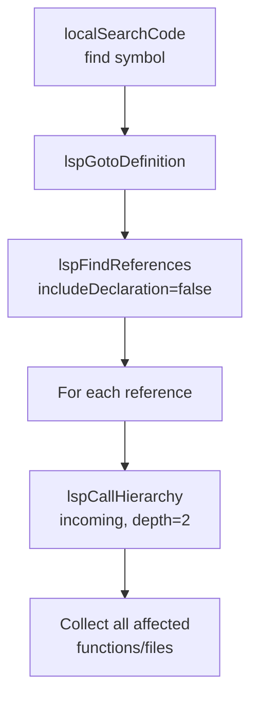

# Octocode MCP Tools Reference

> Complete reference for all Octocode MCP tools - Local exploration, LSP semantic analysis, and research workflows.

---

## Overview

Octocode MCP provides **7 tools** across 2 categories for code research and exploration:

| Category | Tools | Purpose |
|----------|-------|---------|
| **Local Tools** (4) | `localSearchCode`, `localViewStructure`, `localFindFiles`, `localGetFileContent` | File system exploration, pattern search, content reading |
| **LSP Tools** (3) | `lspGotoDefinition`, `lspFindReferences`, `lspCallHierarchy` | Semantic code intelligence via Language Server Protocol |

---

## Tools at a Glance

### Local Tools

| Tool | Description |
|------|-------------|
| **`localSearchCode`** | Fast pattern search across files using ripgrep. Returns matches with line numbers and context. Produces `lineHint` for LSP tools. |
| **`localViewStructure`** | Lists directory contents with metadata (size, type, time). Supports depth control and sorting. |
| **`localFindFiles`** | Finds files by name, type, size, or modification time using recursive metadata search. |
| **`localGetFileContent`** | Reads file content with line ranges or match-based extraction. **Use as LAST step.** |

### LSP Tools

| Tool | Description |
|------|-------------|
| **`lspGotoDefinition`** | Jumps to where a symbol is defined. Requires `lineHint` from search. |
| **`lspFindReferences`** | Finds all usages of a symbol (types, variables, constants). Requires `lineHint`. |
| **`lspCallHierarchy`** | Traces function call relationships (incoming/outgoing callers). Requires `lineHint`. |

### Quick Decision Guide

| Question | Tool |
|----------|------|
| "Where is X defined?" | `localSearchCode` → `lspGotoDefinition` |
| "Who calls function X?" | `localSearchCode` → `lspCallHierarchy(incoming)` |
| "What does X call?" | `localSearchCode` → `lspCallHierarchy(outgoing)` |
| "All usages of type X?" | `localSearchCode` → `lspFindReferences` |
| "Find files named X" | `localFindFiles` |
| "Search for pattern X" | `localSearchCode` |
| "Show directory structure" | `localViewStructure` |
| "Read file content" | `localGetFileContent` (LAST step) |

---

## Local Tools (Detailed)

Fast, text-based exploration tools that work on any codebase without IDE requirements.

### `localSearchCode`

**What it does:** Fast pattern search across files using ripgrep (rg).

| Feature | Description |
|---------|-------------|
| **Pattern matching** | Regex, fixed strings, smart case, multi-line |
| **Output** | Matches with line numbers, byte offsets, context |
| **Filtering** | File type, include/exclude patterns, hidden files |
| **Pagination** | `filesPerPage`, `matchesPerPage`, `filePageNumber` |

**Key parameters:**
- `pattern` (required): Search pattern (regex or literal)
- `path` (required): Directory to search
- `mode`: Workflow presets (`discovery`, `paginated`, `detailed`)
- `filesOnly`: Return only file paths (fast discovery)
- `contextLines`: Lines of context around matches
- `beforeContext`/`afterContext`: Asymmetric context lines
- `type`: File type filter (e.g., `ts`, `js`, `py`)
- `include`/`exclude`: Glob patterns for filtering
- `excludeDir`: Directories to exclude (e.g., `node_modules`)
- `hidden`: Search hidden files (default: false)
- `smartCase`: Smart case sensitivity (default: true)
- `matchesPerPage`/`filesPerPage`/`filePageNumber`: Pagination controls
- `multiline`: Enable multiline matching (memory intensive)

**Critical:** Produces `lineHint` values **required** for all LSP tools.

---

### `localViewStructure`

**What it does:** Lists directory contents with metadata using `ls`.

| Feature | Description |
|---------|-------------|
| **Metadata** | Size, type, permissions, modification time |
| **Depth control** | 1-5 levels deep |
| **Sorting** | By name, size, time, or extension |
| **Filtering** | Pattern, extension, directories/files only |

**Key parameters:**
- `path` (required): Directory to explore
- `depth`: How deep to traverse (default: 1, max: 5)
- `sortBy`: `name`, `size`, `time`, `extension` (default: `time`)
- `filesOnly`/`directoriesOnly`: Filter by type
- `hidden`: Show hidden files (default: false)
- `humanReadable`: Format sizes (e.g., "1.2MB") (default: true)
- `summary`: Include directory summary (default: true)
- `pattern`: Filter by name pattern
- `entriesPerPage`/`entryPageNumber`: Pagination controls

---

### `localFindFiles`

**What it does:** Searches for files/directories recursively using `find`.

| Feature | Description |
|---------|-------------|
| **Name filters** | Glob patterns, regex, case-insensitive |
| **Metadata filters** | Size, permissions, executable |
| **Time filters** | Modified within/before, accessed within |
| **Type filters** | File, directory, symlink |

**Key parameters:**
- `path` (required): Starting directory
- `name`/`iname`: Exact or case-insensitive name pattern
- `regex`: Regex pattern for path matching
- `regexType`: Regex flavor (`posix-egrep`, `posix-extended`, `posix-basic`)
- `type`: `f` (file), `d` (directory), `l` (symlink)
- `modifiedWithin`: Files changed in last N time (e.g., "7d", "2h")
- `sizeGreater`/`sizeLess`: Size filters

---

### `localGetFileContent`

**What it does:** Reads file content with targeted extraction.

| Feature | Description |
|---------|-------------|
| **Line ranges** | `startLine`/`endLine` for specific sections |
| **Match-based** | `matchString` with context lines |
| **Pagination** | `charOffset`/`charLength` for large files |
| **Full content** | `fullContent=true` for small files |

**Key parameters:**
- `path` (required): File to read
- `startLine`/`endLine`: Line range (1-indexed)
- `matchString`: Find specific content with context
- `matchStringContextLines`: Lines around match (default: 5, max: 50)
- `matchStringIsRegex`: Treat matchString as regex (default: false)
- `matchStringCaseSensitive`: Case-sensitive matching (default: false)
- `charOffset`/`charLength`: Character-based pagination for large files
- `fullContent`: Read entire file (use sparingly)

**⚠️ Should be the LAST step** after search/LSP analysis.

---

## LSP Tools (Detailed)

Semantic code intelligence tools that understand language structure. **All require `lineHint` from `localSearchCode`.**

### How LSP Works

```
MCP Client → Octocode MCP → Language Server (spawned)
               │                    │
               └── JSON-RPC over stdio ──┘
```

- **No IDE required** - Works standalone via spawned language servers
- **TypeScript/JavaScript bundled** - Works out-of-box
- **30+ languages supported** - Python, Go, Rust, Java, etc. (requires server installation)

### `lspGotoDefinition`

**What it does:** Jump to where a symbol is defined.

| Feature | Description |
|---------|-------------|
| **Semantic accuracy** | Ignores comments, strings, similar names |
| **Cross-file** | Traces imports and definitions |
| **Context** | Returns surrounding code |

**Key parameters:**
- `uri` (required): File containing the symbol
- `symbolName` (required): Exact symbol name (case-sensitive, max 255 chars)
- `lineHint` (required): Line number from `localSearchCode` (1-indexed)
- `orderHint`: Which occurrence on line if multiple (0-indexed, default: 0)
- `contextLines`: Lines of context around definition (default: 5, max: 20)

**Use when:** "Where is this function/class/variable defined?"

---

### `lspFindReferences`

**What it does:** Find all usages of a symbol across the codebase.

| Feature | Description |
|---------|-------------|
| **Complete coverage** | All usages, not just text matches |
| **Pagination** | Handle large result sets |
| **Include declaration** | Optionally include the definition |

**Key parameters:**
- `uri` (required): File containing the symbol
- `symbolName` (required): Exact symbol name (max 255 chars)
- `lineHint` (required): Line number from search
- `orderHint`: Which occurrence on line if multiple (0-indexed, default: 0)
- `includeDeclaration`: Include definition in results (default: true)
- `contextLines`: Lines of context (default: 2, max: 10)
- `referencesPerPage`: Results per page (default: 20, max: 50)
- `page`: Page number (default: 1)

**Use when:** "Who uses this type/interface/variable/constant?"

---

### `lspCallHierarchy`

**What it does:** Trace function call relationships (call graph).

| Feature | Description |
|---------|-------------|
| **Incoming calls** | "Who calls this function?" |
| **Outgoing calls** | "What does this function call?" |
| **Recursive depth** | Traverse 1-3 levels deep |

**Key parameters:**
- `uri` (required): File containing the function
- `symbolName` (required): Function name (max 255 chars)
- `lineHint` (required): Line number from search
- `direction` (required): `incoming` or `outgoing`
- `orderHint`: Which occurrence on line if multiple (0-indexed, default: 0)
- `depth`: Recursion depth (1-3, default: 1)
- `contextLines`: Lines of context (default: 2, max: 10)
- `callsPerPage`: Results per page (default: 15, max: 30)
- `page`: Page number (default: 1)

**Use when:** "Trace the call flow" / "Who calls X?" / "What does X call?"

### LSP Security

- **Symlink Resolution**: Paths resolved before access to prevent traversal attacks
- **Symbol Name Length**: Limited to 255 characters
- **Depth Parameter**: Capped at 3 to prevent resource exhaustion
- **Path Redaction**: When `REDACT_ERROR_PATHS=true`, full paths hidden in errors

> LSP tools work standalone - no IDE required. TypeScript/JavaScript bundled; other languages need server installation.

---

## LSP Configuration & Setup

### Supported Languages

| Status | Languages |
|--------|-----------|
| **Bundled** | TypeScript (`.ts`, `.tsx`), JavaScript (`.js`, `.jsx`, `.mjs`, `.cjs`) |
| **Requires Install** | Python, Go, Rust, Java, Kotlin, C/C++, C#, Ruby, PHP, Swift, Dart, Lua, Zig, Elixir, Scala, Haskell, OCaml, Clojure, Vue, Svelte, YAML, TOML, JSON, HTML, CSS, Bash, SQL, GraphQL, Terraform |

For full installation commands, see [LSP_TOOLS.md](./LSP_TOOLS.md#supported-languages).

### Environment Variables

Override language server paths:

| Variable | Language |
|----------|----------|
| `OCTOCODE_TS_SERVER_PATH` | TypeScript/JavaScript |
| `OCTOCODE_PYTHON_SERVER_PATH` | Python |
| `OCTOCODE_GO_SERVER_PATH` | Go |
| `OCTOCODE_RUST_SERVER_PATH` | Rust |
| `OCTOCODE_JAVA_SERVER_PATH` | Java |
| `OCTOCODE_CLANGD_SERVER_PATH` | C/C++ |

### Custom Configuration

Config files are loaded in priority order:

1. `OCTOCODE_LSP_CONFIG=/path/to/config.json` (env var)
2. `.octocode/lsp-servers.json` (workspace)
3. `~/.octocode/lsp-servers.json` (user)

```json
{
  "languageServers": {
    ".py": {
      "command": "pylsp",
      "args": [],
      "languageId": "python"
    }
  }
}
```

### Graceful Degradation

If a language server is not installed:
1. Tool returns helpful error with installation instructions
2. **No crashes** - other tools continue working
3. Works on macOS, Linux, and Windows

---

## LSP Troubleshooting

| Problem | Solution |
|---------|----------|
| "LSP server not found" | Install server, verify in PATH, or set env var |
| "Symbol not found" | Ensure `symbolName` is exact (case-sensitive), check `lineHint` is ±2 lines of actual position |
| "Empty results" | Symbol may not exist at location, file may not be in workspace |
| "Timeout" | Use smaller `depth`, first request may be slow (server init) |

---

## Research Flows

### The Funnel Method (Core Principle)

Every research task should follow this progressive narrowing:

```
DISCOVER → SEARCH → LOCATE/ANALYZE → READ
    │         │           │            │
    ▼         ▼           ▼            ▼
Structure  Pattern     Semantic    Implementation
 & Scope   Matching    Analysis      Details
```

| Stage | Tools | Algorithm | Purpose |
|-------|-------|-----------|---------|
| 1. DISCOVER | `localViewStructure`, `localFindFiles` | Tree O(d), Metadata O(1) | Narrow scope 80-90% |
| 2. SEARCH | `localSearchCode` | Inverted Index O(1) | Find patterns, **get `lineHint`** |
| 3. LOCATE | `lspGotoDefinition` | Symbol Table O(1) | Jump to definition |
| 3. ANALYZE | `lspFindReferences`, `lspCallHierarchy` | Graph DFS/BFS | Usage & call flow |
| 4. READ | `localGetFileContent` | I/O | Implementation (LAST!) |

**Golden Rule:** Text narrows → Symbols identify → Graphs explain

---

## Task-Specific Workflows

### Flow 1: "Where is X defined?"



**Steps:**
1. `localSearchCode(pattern="functionName", path="/src")` → Get line number
2. `lspGotoDefinition(uri="file.ts", symbolName="functionName", lineHint=42)`
3. Result: Definition location with surrounding code

---

### Flow 2: "Who calls function X?"



**Steps:**
1. `localSearchCode(pattern="def processData", path="/src")` → Line 50
2. `lspCallHierarchy(uri="handler.py", symbolName="processData", lineHint=50, direction="incoming")`
3. Result: All functions that call `processData`
4. Optional: Follow each caller with another `lspCallHierarchy` call

---

### Flow 3: "What does function X call?"



**Steps:**
1. `localSearchCode(pattern="async function fetchData")` → Line 25
2. `lspCallHierarchy(symbolName="fetchData", lineHint=25, direction="outgoing")`
3. Result: All functions that `fetchData` calls

---

### Flow 4: "All usages of type/interface X"



**Steps:**
1. `localSearchCode(pattern="interface UserConfig")` → Line 10
2. `lspFindReferences(symbolName="UserConfig", lineHint=10, includeDeclaration=true)`
3. Result: Every file/line where `UserConfig` is used

**Note:** Use `lspFindReferences` (not `lspCallHierarchy`) for types, interfaces, variables, and constants.

---

### Flow 5: "Trace code flow from A to B"



**Steps:**
1. Find entry point: `localSearchCode(pattern="handleRequest")`
2. Jump to definition: `lspGotoDefinition(lineHint=N)`
3. Get outgoing calls: `lspCallHierarchy(direction="outgoing")`
4. For each callee, repeat step 2-3 until target found
5. Finally: `localGetFileContent(matchString="targetFunction")` for details

---

### Flow 6: "Explore new codebase"



**Steps:**
1. `localViewStructure(path="/", depth=1)` → See root structure
2. `localViewStructure(path="/src", depth=2)` → Drill into source
3. `localSearchCode(pattern="export", filesOnly=true)` → Find entry points
4. `localFindFiles(modifiedWithin="7d")` → See recent changes
5. `localGetFileContent(path="README.md", fullContent=true)` → Read docs

---

### Flow 7: "Find files by pattern/metadata"



**By name:** `localFindFiles(name="*.test.ts")`
**By content:** `localSearchCode(pattern="describe\\(", filesOnly=true)`
**By time:** `localFindFiles(modifiedWithin="24h")`
**By size:** `localFindFiles(sizeGreater="1M")`

---

### Flow 8: "Impact analysis - What breaks if I change X?"



**Steps:**
1. Find the symbol: `localSearchCode(pattern="validateInput")`
2. Get definition: `lspGotoDefinition(lineHint=N)`
3. Find all usages: `lspFindReferences(includeDeclaration=false)`
4. For each usage, trace callers: `lspCallHierarchy(incoming, depth=2)`
5. Result: Complete list of affected code paths

---

## Quick Reference

### Tool Selection Guide

| Question | Tool |
|----------|------|
| "Show me the directory structure" | `localViewStructure` |
| "Find files named X" | `localFindFiles` |
| "Search for pattern X in code" | `localSearchCode` |
| "Read the contents of file Y" | `localGetFileContent` |
| "Where is X defined?" | `lspGotoDefinition` |
| "Who uses X?" (types/vars) | `lspFindReferences` |
| "Who calls function X?" | `lspCallHierarchy(incoming)` |
| "What does X call?" | `lspCallHierarchy(outgoing)` |

### LSP Tool Selection by Symbol Type

| Symbol Type | Tool | Why |
|-------------|------|-----|
| Function/Method | `lspCallHierarchy` | Call relationships |
| Type/Interface | `lspFindReferences` | All usages |
| Class | `lspFindReferences` | All usages |
| Variable/Constant | `lspFindReferences` | All usages |

---

## Critical Rules

### ⚠️ Rule 1: LSP Tools REQUIRE `lineHint`

```
❌ WRONG: lspGotoDefinition(symbolName="foo")  
✅ RIGHT: localSearchCode → get lineHint → lspGotoDefinition(lineHint=42)
```

Always search first to get the line number!

### ⚠️ Rule 2: `lineHint` is 1-indexed

Line 1 = first line of file (not 0).

### ⚠️ Rule 3: Don't Read Files for Flow Analysis

```
❌ WRONG: localGetFileContent → localGetFileContent → manual import tracing
✅ RIGHT: localSearchCode → lspCallHierarchy → follow the graph
```

LSP tools are O(1) lookup; manual file reading is O(N) traversal.

### ⚠️ Rule 4: `localGetFileContent` is LAST

Only read file content after you've narrowed down exactly what you need via search and LSP analysis.

### ⚠️ Rule 5: Use `filesOnly=true` for Fast Discovery

When you just need to know which files contain something:
```
localSearchCode(pattern="TODO", filesOnly=true)  // Fast
localSearchCode(pattern="TODO")  // Returns all matches (slower)
```

---

## Anti-Patterns to Avoid

| Anti-Pattern | Why It's Wrong | Correct Approach |
|--------------|----------------|------------------|
| Reading files without searching first | O(N) vs O(1) | Search → LSP → Read |
| Using `lspCallHierarchy` on types | Fails - types aren't callable | Use `lspFindReferences` |
| Guessing `lineHint` | LSP needs exact location | Always `localSearchCode` first |
| Using `fullContent=true` on large files | Token waste | Use `matchString` or line ranges |
| Multiple `localGetFileContent` for flow | Manual tracing | Use `lspCallHierarchy` |

---

## Parallel Execution

Tools with no dependencies can run in parallel:

```
✅ Parallel OK:
- localSearchCode(pattern="A") + localSearchCode(pattern="B")
- localViewStructure(path="/src") + localViewStructure(path="/tests")
- lspFindReferences(symbolA) + lspFindReferences(symbolB)

❌ Must be Sequential:
- localSearchCode → lspGotoDefinition (needs lineHint)
- lspGotoDefinition → lspCallHierarchy (needs definition location)
```

**Batch limits:**
- Local tools: Up to 5 queries per call
- LSP tools: 5 queries per call (except `lspCallHierarchy`: 3 max)
